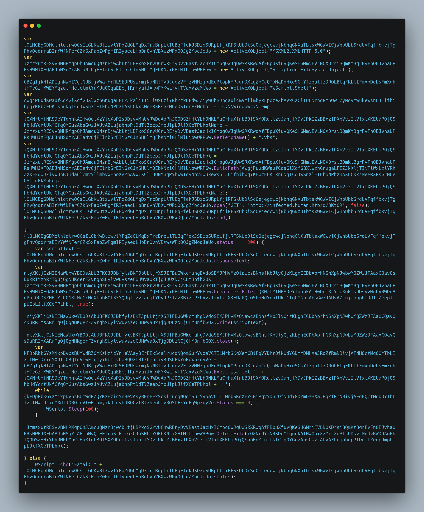
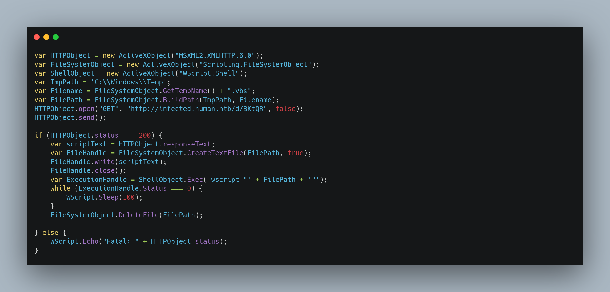
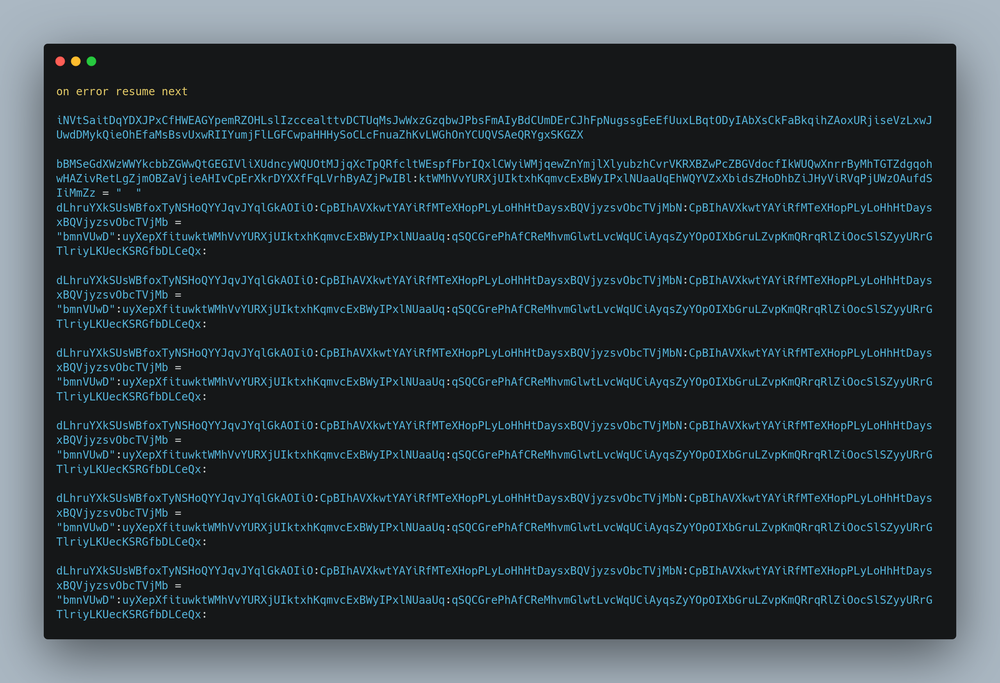
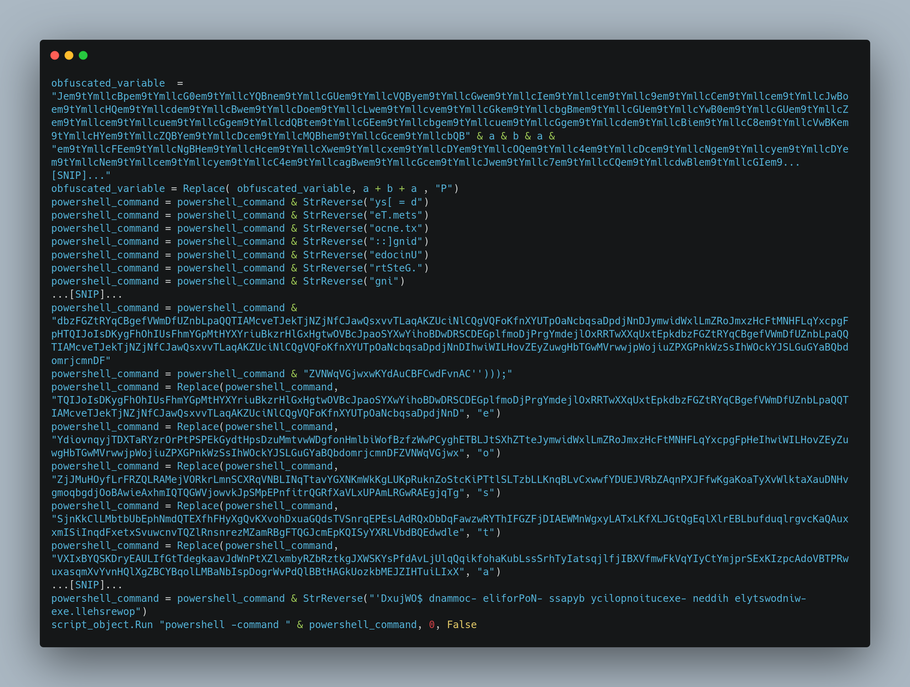
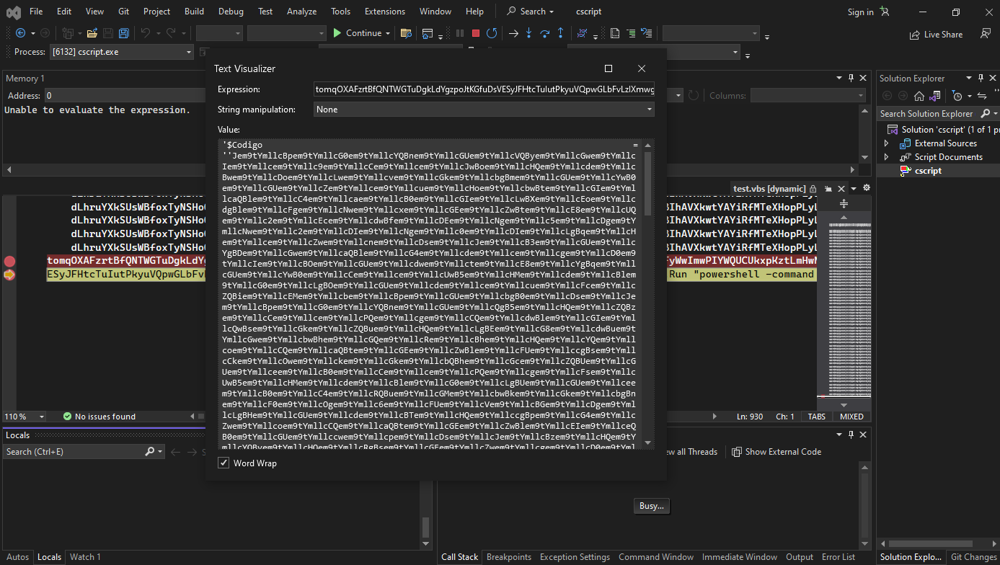
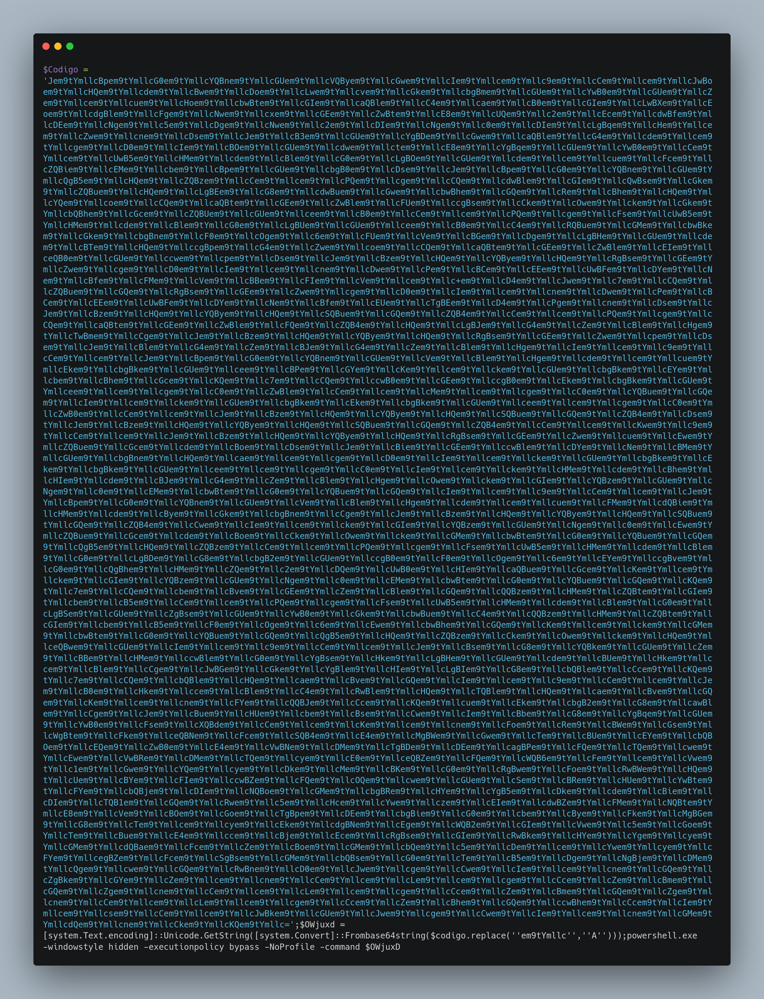
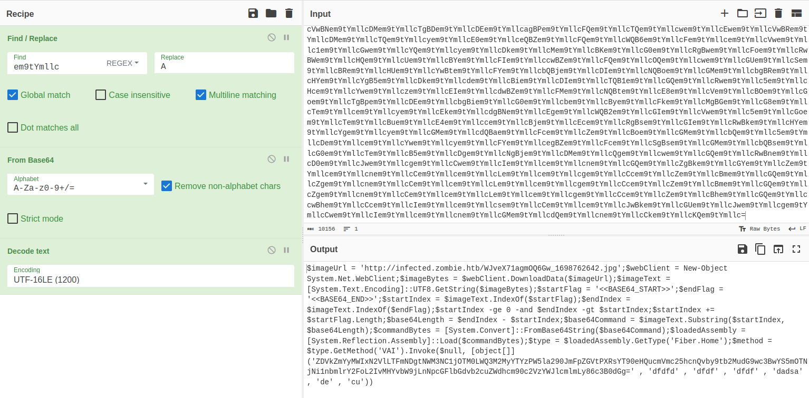
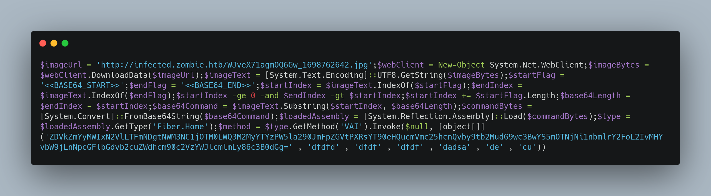
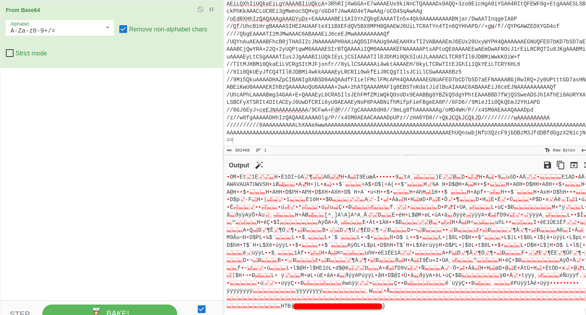

 <font size='10'>One Step Closer</font>

20<sup>th</sup> November 2023 / Document No. D23.102.XX

Prepared By: thewildspirit

Challenge Author(s): thewildspirit

Difficulty: <font color=orange>Easy</font>

Classification: Official

# Synopsis

One step colser is an easy forensics challenge that involves analyzing a malicious js attachment leading to VBS and PowerShell code execution.

## Description

* Tasked with defending the antidote's research, a diverse group of students united against a relentless cyber onslaught. As codes clashed and defenses were tested, their collective effort stood as humanity's beacon, inching closer to safeguarding the research for the cure with every thwarted attack. A stealthy attack might have penetrated their defenses. Along with the Hackster's University students, analyze the provided file so you can detect this attack in the future. *Note:** Make sure you edit `/etc/host` so that any hostnames found point to the Docker IP.

## Skills Required

* Familiarity with malware delivery techniques

## Skills Learned

* Analyzing malicous Java-Script code
* Analyzing malicious VBS code
* Analyzing malicious PowerShell code
* Extracting hidden payloads

# Enumeration

Players are given the following file:

* **vaccine.js**: Malicious JS attachment.

Opening this file, we immediately notice that is heavily obfuscated. The code contains 2 functions that are never used, and a few lines that are actually executed as it can be seen below.



Allthough it seems hard to read, the only obfuscation technique used, is replacing variable and function names with large random strings. To be able to read it, we need to replace the variables with simple names.



Now we can easily read the code. To sum up, the attacker downloads a what it seems to be a `VBS` file, saves it on the temp folder and executes it. The malicious `VBS` file is downloaded from this URL `http://infected.human.htb/d/BKtQR`. Accessing this link, we can continue to the second step. 

Since the second step is even more heavily obfuscated, in the screenshot below, can be seen only a small part of the script.



Again, we notice very large and random variable names, random variable names being declared and not being used later on the code. Renaming and removing the unused variables will help us understand the script better.


Things we have to note so far:
* Replace obfuscation techniques have been used.
* A powershell command is being created.
* The powershell command is executed at the end.

We can either continue using a static analysis approach or we can contiue our analysis dynamically. The easier way is the dynamic one and we will use it for this writeup.

Saving the code into a file called `malicious.vbs` we can debug it by using `cscript.exe` as follows:

```cmd
cscript.exe //X malicious.exe
```

And by placing a breakpoint at the last line we can see the content of the variable that is being passed as an argument to the `Run` function.



The powershell script can be seen below:



To deobfuscate it, and learn what the attacker is trying to execute we need to:
* Replace `em9tYmllc` with `A`.
* Base64-decode it.

We can use cyberchef for this:



The final PowerShell script can be seen here:



* It downloads an image from this URL: `http://infected.zombie.htb/WJveX71agmOQ6Gw_1698762642.jpg`
* It carves out an embedded base64 string starting from the offset `<<BASE64_START>>` until `<<BASE64_END>>`.
* Base64 decodes it.
* Executes it using reflection.

# Solution

We can download the image from the previously found link and carve out the base64 string using just an editor.

By decoding it we can see the flag.
